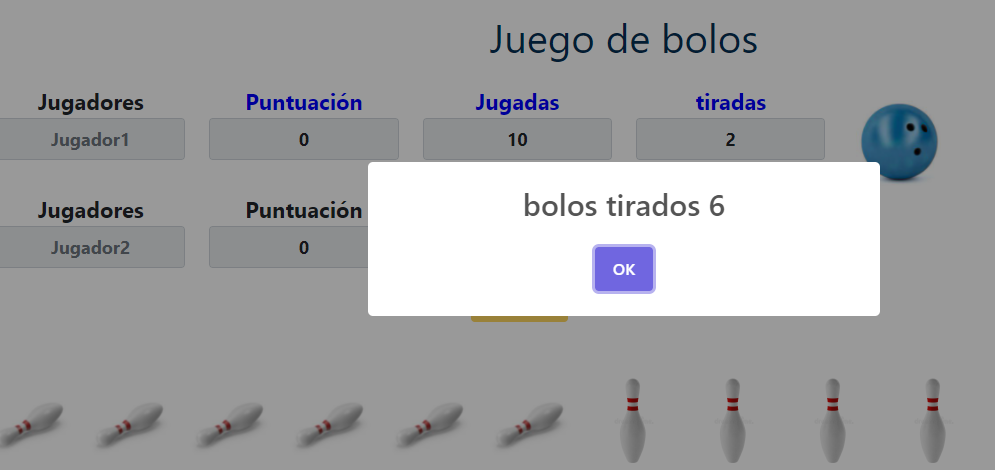

# UNIDAD 5: Modelo de objetos del documento en JavaScript
## 
¿Qué te pedimos que hagas?

## Juego de bolos
Vamos a crear una página que simule una partida de bolos. Los jugadores tendrán *tiradas*. En cada tirada, cada jugador tiene 2 lanzamientos para lograr tirar 10 bolos. La puntuación de cada tirada será el número total de bolos derribados, sumando además los bonus correspondientes por **strike** o **spare**.

Un **spare** ocurre cuando el jugador consigue derribar los 10 bolos en una tirada (dos lanzamientos). Cuando esto ocurra, el jugador dispondrá de un lanzamiento adicional. el bonus obtenido en eta tirada será el número de bolos derribados en este último lanzamiento.

Un **strike** se produce cuando el jugador logra tirar todos los bolos en su primer lanzamiento. Cuando esto ocurra, además de conducir con el segundo lanzamiento de la tirada, el jugador recibirá dos lanzamientos adicionales, siendo la suma de todos ellos, el bonus obtenido.

Al cargar la página tendrá un aspecto parecido a este:

1. Al pulsar el botón Comenzar se establecerá el jugador que comenzará la partida de forma aleatoria.

- Cambiar los labels de jugador que comenzará la partida a color azul. 
- Crear en ejecución con DOM (como se ha visto en el tema), la bola y los 10 bolos.
- El botón Comenzar se deshabilitará.

2. Al pulsar la imagen de la bola:

- Comenzará la jugada del jugador activo.
- Generar por cada tirada un número aleatorio del 0 al nº de bolos en pie.
- Mostrar un mensaje con el nº de bolos generados aleatoriamente
- Cambiar los bolos en pie por la imagen de bolo caído.
- Tened en cuenta los bonus, spare o strike.

3. Este proceso se repetirá hasta que  las tiradas de esa jugada sean 0 que pasará el turno al siguiente jugador.

4. El juego acaba cuando los dos jugadores han acabado sus jugadas. Mostrar con un mensaje el jugador que ha ganado y la puntuación obtenida.

## Importante

- Prohibido el uso de innerHTML y document.write. La idea es usar métodos y propiedades del tipo de crear elementos, nodos, hijos de los nodos, etc. La elección será vuestra. Si los utilizáis correctamente os ayudarán a entender mejor el sistema en árbol utilizado por DOM.
- La programación de la aplicación JavaScript la tendrás que realizar en un fichero `.js` y tendrá que ser cross-browser funcionando perfectamente en Firefox y Google Chrome.
- Los eventos deben enlazarse con `addEventListener()` no con sistemas obsoletos de Microsoft  (o sea, utilizar W3C al igual que en la unidad anterior y no BOM).
- Se puede implementar la librería `Bootstrap` para utilizar estilos.
- También podéis utilizar la librería [sweetAlert2](https://sweetalert2.github.io/) para mostrarlos mensajes.
- Queda terminantemente prohibido usar JQuery o similares. Debéis usar DOM directamente y sin intermediarios.

--- 

## Resultado

**Calificación**: 9,75 / 10,00

Calificado el jueves, 19 de mayo de 2022, 11:03 por Sánchez Rubio, Mª Luz

**Comentario**: Debes informar que se ha producido un strike o spare y el bonus que ha obtenido.