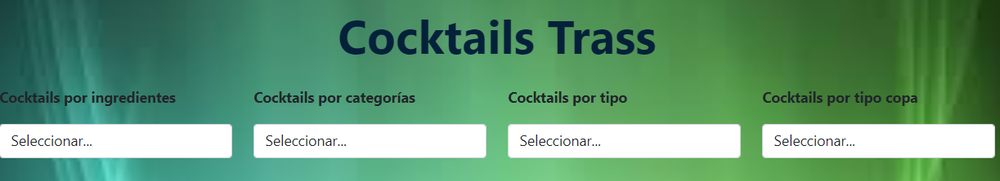
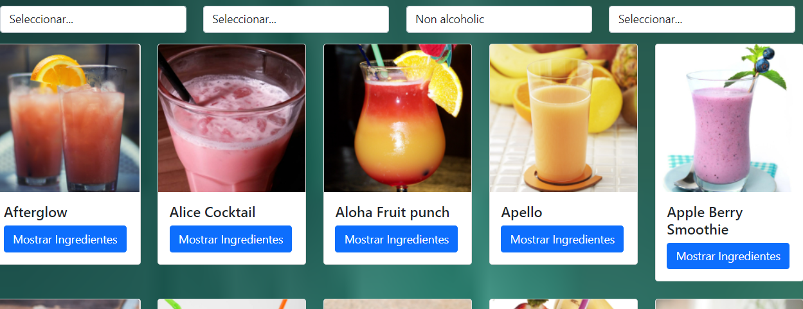

# UNIDAD 6: Programación AJAX en JavaScript
## 
¿Qué te pedimos que hagas?

## TheCocktailDB
Hay una API gratuita que nos va a permitir consultar los diferentes cocktails que hay en la BD llamada [TheCocktailDB](https://www.thecocktaildb.com/api.php).  

La aplicación va a permitir mostrar cocktails dependiendo del filtro seleccionado. Vamos a utilizar jQuery y JSON, para mostrar esa información en un solo archivo `.html` y con un solo `.js`.  Opcionalmente, podrá utilizarse un fichero `.css` para el estilo. No es necesario utilizar clases. 

Se va a realizar una pequeña aplicación web que tenga 4 select y una capa para mostrar los endpoints obtenidos de las peticiones AJAX que se realizan. 

Cada select se cargará al inicio de la aplicación y se hará con las siguientes características: 

- Cocktails por ingredientes:  Se mostrará el atributo `strIngredient1`, ordenado ascendentemente. La petición AJAX se realizará mediante `Fetch API`. 
- Cocktaisl por categorías:  Se mostrará el atributo `strCategoria`, ordenado ascendentemente. La petición AJAX se realizará mediante `jQuery`. 
- Cocktails por tipo:  Se mostrará el atributo `strAlcoholic`, ordenado ascendentemente. La petición AJAX se realizará mediante `XMLHTTPRequest`. 
- Cocktails por tipo copa:  Se mostrará el atributo `strGlass`, ordenado ascendentemente. La petición AJAX se realizará mediante `axios`. 

Ejemplo tipo:

Al seleccionar cualquier opción de un filtro se hará lo siguiente:

- Mostrar mediante la librería `sweetAlert2`, el número de cocktails mostrados. 
- Mostrar los cocktails ordenados por el nombre. Visualizar la imagen, el nombre y un enlace o botón que permita mostrar los ingredientes de ese cocktail. Independientemente de la selección que se haya realizado, se hará en una única función para simplificar. La petición AJAX a utilizar será libre.
- Para mostrar cada cocktail se ha utilizado la clase **card** de bootstrap. Podrá usarse otro estilo pero debe contener los datos expuestos en el punto anterior y un diseño atractivo. 
- Al pulsar Mostrar Ingredientes, aparecerá un mensaje con los ingredientes del cocktail. El endpoint que devuelve la API tiene 15 ingredientes, los que tienes el valor null, no se muestran. Utilizad la librería `sweetAlert2`. 

--- 

## Resultado

**Calificación**: 9,50 / 10,00

Calificado el jueves, 19 de mayo de 2022, 11:57 por Sánchez Rubio, Mª Luz

**Comentario**: Los break solo deben utilizarse en los case. Tienes que utilizar otras formas más correctas para salirte de un bucle.