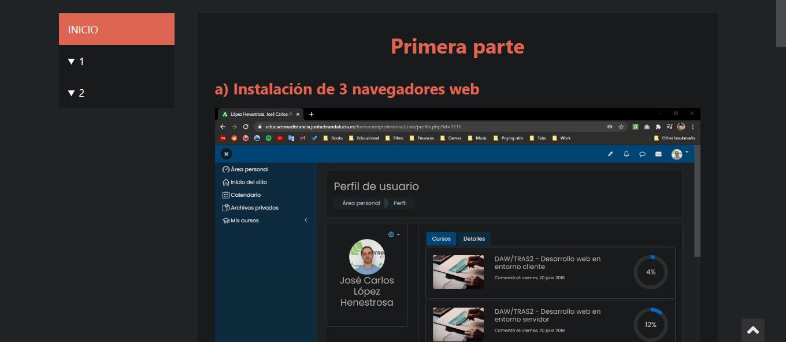

# Desarrollo Web en Entorno Cliente

>[!NOTE]
>Haz click en su imagen para abrir una página web con el ejercicio desplegado.

<table>
	<tr>
		<th>UNIDAD</th>
		<th>CAPTURA DE LA TAREA</th>
		<th>CALIFICACIÓN DE LA TAREA</th>
	</tr>
	<tr>
		<td>
			<a href="https://github.com/HenestrosaDev/2-daw/tree/main/desarrollo_web_en_entorno_cliente/u1">
				1. Tecnologías aplicadas en clientes web
			</a>
		</td>	
		<td>
			
		</td>
		<td>6,50 / 10,00</td>
	</tr>
	<tr>
		<td>
			<a href="https://github.com/HenestrosaDev/2-daw/tree/main/desarrollo_web_en_entorno_cliente/u2">
				2. Objetos nativos de JavaScript
			</a>
		</td>
		<td>
			
		</td>
		<td>9,00 / 10,00</td>
	</tr>
	<tr>
		<td>
			<a href="https://github.com/HenestrosaDev/2-daw/tree/main/desarrollo_web_en_entorno_cliente/u3">
				3. Estructuras definidas por el usuario en JavaScript
			</a>
		</td>
		<td>
			
		</td>
		<td>9,00 / 10,00</td>
	</tr>
	<tr>
		<td>
			<a href="https://github.com/HenestrosaDev/2-daw/tree/main/desarrollo_web_en_entorno_cliente/u4">
				4. Gestión de eventos y formularios en JavaScript
			</a>
		</td>
		<td>
			
		</td>
		<td>9,50 / 10,00</td>
	</tr>
	<tr>
		<td>
			<a href="https://github.com/HenestrosaDev/2-daw/tree/main/desarrollo_web_en_entorno_cliente/u5">
				5. Modelo de objetos del DOM en JavaScript
			</a>
		</td>
		<td>
			
		</td>
		<td>9,75 / 10,00</td>
	</tr>
	<tr>
		<td>
			<a href="https://github.com/HenestrosaDev/2-daw/tree/main/desarrollo_web_en_entorno_cliente/u6">
				6. Programación AJAX en JavaScript
			</a>
		</td>
		<td>
			
		</td>
		<td>9,50 / 10,00</td>
	</tr>
	<tr>
		<td colspan="2"></td>
		<td></td>
	</tr>
	<tr>
		<td colspan="2">
			<strong>CALIFICACIÓN MEDIA</strong>
		</td>
		<td>8,88 / 10,00</td>
	</tr>
</table>
