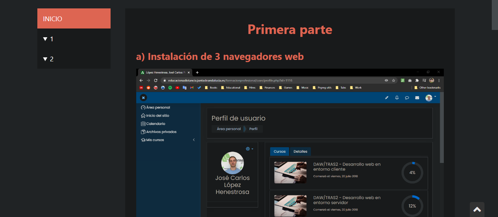

# TAREA Unidad 1: Arquitecturas y lenguajes de programación en clientes web

## Índice

- [¿Qué te pedimos que hagas?](#qué-te-pedimos-que-hagas)
	- [Primera parte (3 ptos).](#primera-parte-3-ptos)
	- [Segunda parte (7 ptos).](#segunda-parte-7-ptos)
- [Notas](#notas)
- [Resultado](#resultado)

 

## ¿Qué te pedimos que hagas? 

En esta primera tarea nos vamos a realizar la configuración de nuestro sistema y también unos pequeños programas para realizar nuestros primeros scripts. Así pues esta tarea tiene dos partes diferenciadas.

En la primera se realiza la instalación de las herramientas y navegadores que se van a usar en el curso. En la segunda se comienza con JavaScript propiamente dicho.

### Primera parte (3 ptos). 

Esta se realizará en un documento que contenga las capturas (auntenticables, de esas que se ve vuestro perfil de distancia al fondo).

<ol type="a">
	<li>Elige e instala en tu sistema operativo al menos 2 navegadores web (adicionales al que ya tienes instalado por defecto). Por ejemplo, si ya tienes instalado Firefox instala otros dos más.</li>
	<li>¿Por qué es conveniente tener instalados al menos dos navegadores diferentes en tu ordenador?  Indica el nombre del motor HTML y JavaScript de los navegadores que has instalado.</li>
	<li>Entre en el hijo específico que se ha abierto en el foro y haz un comentario sobre si ha hecho bien Microsoft con su Edge Chromium abandonando su motor y usando de Google. Realiza una captura de tu intervención y añádela al documento.</li>
	<li>Entre en el hilo específico que se ha abierto en el foro  y haz un comentario sobre navegadores independientes. Realiza una captura de tu intervención y añádela al documento. </li>
	<li>Elige un editor para JavaScript e instálalo.  En los materiales hay ejemplos de  editores JavaScript. No te olvides de realizar una comparación entre los que pienses instalar.</li>
	<li>Para finalizar, usando la dirección de validación del W3C indicada en los apuntes, realiza la validación de la página del <a href="https://www.elcorteingles.es">Corte Inglés</a>. Indica la solución solamente a 3 problemas distintos.</li>
</ol>

### Segunda parte (7 ptos). 

Vas a necesitar `prompt`, `document.write` o `console.log` para realizar la comunicación con el usuario. 

1. **Primos**. Calcula los 100 primeros n�meros primos con distintos bucles.   

2. **Calificaciones**.  Realiza un script que permita introducir una calificación de 1 a 10 y muestre por consola la calificación cualitativa. Si  la calificación es diferente de 1 a 10, se mostrará un error y volverá a pedir la nota. Se utilizará la estructura de control `switch`. El proceso se repetirá hasta que la calificación sea 0. 

3. **Triángulo**: Realiza un programa que permita introducir tres longitudes y determine si forman o no un triángulo. Considere que para formar un triángulo se requiere que, "el lado mayor sea menor que la suma de los otros dos lados". El proceso se repetirá hasta que `lado1` sea un 0. Si es un triángulo, mostrar en pantalla el tipo de triángulo:

	- Si tienen tres lados iguales es equilátero.
	- Si tiene dos lados iguales es isósceles.
	- Si tienen tres lados desiguales es escaleno.

Los comentario y calidad del código también son un CE que se evaluará.

## Notas

Cada ejercicio tendrá un archivo HTML y un fichero externo donde se encontrará el código JavaScript. Si en el foro se ha aclarado una duda sobre un apartado de la tarea y realizas mal esta actividad, tendrás un 0 en esa parte.

---

## Resultado

**Calificación**: 6,50 / 10,00

Calificado el jueves, 19 de febrero de 2022, 23:35 por Sánchez Rubio, Mª Luz

**Comentarios de retroalimentación**: José Carlos, las tareas hay que hacerlas con lo visto en las unidades. Las entradas de los datos se realizan mediante el método `prompt`. Según vayamos avanzando en las unidades iremos introduciendo nuevos contenidos en nuestros script pero ahora nos ajustamos a la unidad, powerpoint subido al foro y a las explicaciones en las clases telemáticas.