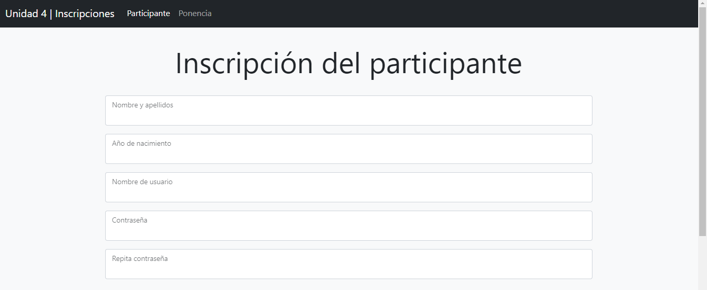

[](https://lhjc-dwec-tarea4.netlify.app/)

# TAREA Unidad 4: Gestión de eventos y formularios en JavaScript

## Índice

- [¿Qué te pedimos que hagas?](#qué-te-pedimos-que-hagas)
	- [Jornadas TrassInformática 2022](#jornadas-trassinformática-2022)
- [Notas](#notas)
- [Resultado](#resultado)

<br>

## ¿Qué te pedimos que hagas?

### Jornadas TrassInformática 2022

Vamos a realizar dos páginas web, colgadas desde un índice que contendrá los siguientes enlaces:

- Sección de inscripción del participante.
- Sección de inscripción de ponencias.

Cada una de las secciones tendrá una sola página y un archivo JavaScript, siguiendo las siguientes instrucciones:

**1. Sección de inscripción del participante. (7 puntos)**

En este ejercicio, la validación de formularios se hará mediante JavaScript y no mediante HTML5. Esta sección debe disponer de los siguientes campos obligatorios:

- **Nombre y apellidos**. Cuando pierda el foco, los caracteres se convertirán en mayúsculas. 
- **Año de nacimiento**: Estará comprendido entre  1957 y 2003. Validar mediante expresión regular.
- **Usuario**: Validar mediante expresión regular:
	+ Mínimo 5 y máximo 15 caracteres.
	+ letras, incluida la *ñ*, vocales acentuadas, números y la barra _
	+ El primer carácter será una consonante en mayúscula. El resto de caracteres en minúsculas.

- **Password**.
	+ Debe tener al menos un número par.
	+ Debe tener al menos un carácter $&@#
	+ Debe tener al menos un carácter alfabético en mayúscula.
	+ No puede contener la palabra *pass*.
	+ Al menos 8 caracteres y 20 máximo.

- **Repita password**. Debe coincidir con la password escrita. Según vaya escribiendo la password, el contenido estará en color rojo y cuando sean iguales el texto estará en verde.

- **Tipo de jornada**: checkbox. Como mínimo, elegirá una opción y, como máximo, tres. Tendrá las siguientes opciones:
	+ Ciberseguridad
	+ Videojuegos
	+ Desarrollo Web
	+ Big Data.
	+ Desarrollo Multiplataforma

- Una etiqueta antes de cada campo a rellenar. 

- Un span después de cada campo a rellenar o seleccionar para mostrar el posible error.

- Botón **Reestablecer**. Borra todos los contenidos.

- Botón **Enviar**.
	+ Al pulsar este botón se comprobará que todos los datos son requeridos y que los datos son correctos según lo establecido en las expresiones regulares y en las especificaciones del ejercicio.
	+ El aviso de datos incorrectos se realizarán en el span correspondiente al dato y se cambiará el fondo de la caja de texto al color amarillo. 
	+ Si todos los datos son correctos, mostrarlos en una ventana modal y pedir confirmación de envío. 

**2. Sección de inscripción de ponencias (3 puntos)**

La validación de formularios se hará según las especificaciones de HTML5. Se van a crear los tipos de ponencias en las cuales pueden participar los participantes

- **Título**. Son caracteres alfabéticos, numéricos, espacios y signos de puntuación.  La longitud será de 5 a 50. Obligatorio. Cuando la página se cargue, tendrá el foco.
- **Descripción**. Permitirá varias líneas. Máximo 500 caracteres. No obligatorio.
- **Ponente**.  Son caracteres alfabéticos mayúsculas y minúsculas, vocales acentuadas, *ñ* y espacios. La longitud va de 10 a 45. Obligatorio.
- **Categoría**. Un Select que indicar la categoría. Obligatorio.
	+ Ciberseguridad.
	+ Videojuegos.
	+ Desarrollo Web.
	+ Big Data
	+ Desarrollo Multiplataforma
- **Aforo**. Mínimo 50 plazas y máximo 200. 
- Botón **Enviar**. Este botón lo que hace es mostrar los datos del formulario abajo en una capa `div`. 
- Botón **Borrar**. Borra todos los contenidos.

## Notas

- Se comentarán las partes de las expresiones regulares utilizadas mediante comentarios.
- Se prohíbe el uso de eventos BOM (tipo `onclick="hazalgo()"`). Se utilizarán solo los sistemas aprobados por W3C (Modelo de registro avanzado de eventos según **W3C**). O sea, con `addEventListener()`. 
- Se prohíbe el uso de **jQuery** para la realización de la tarea.
- Va a hacerte falta el uso `event.preventDefault()` para evitar que se envíe la página y se pueda utilizar lo siguiente.
	+ Para poder actualizar el contenido de un contenedor o `div` la propiedad que tenemos que modificar para ese objeto es `innerHTML`.

```html
<div id="resultado>
	Al actualizar este contenido se borra.
</div>

<script>
	document.getElementById("resultado").innerHTML="Aquí pones el código que quieres que aparezca en la capa resultado";
</script>
```

---

## Resultado

**Calificación**: 9,50 / 10,00

Calificado el jueves, 6 de marzo de 2022, 11:37 por Sánchez Rubio, Mª Luz