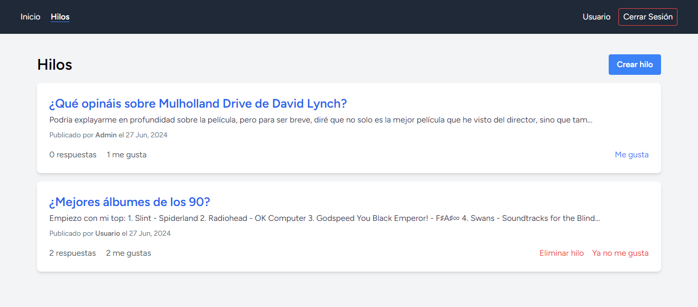

# Desarrollo Web en Entorno Servidor

<table>
	<tr>
		<th>UNIDAD</th>
		<th>CAPTURA DE LA TAREA</th>
		<th>CALIFICACIÓN DE LA TAREA</th>
	</tr>
	<tr>
		<td>
			<a href="https://github.com/HenestrosaDev/2-daw/tree/main/desarrollo_web_en_entorno_servidor/u1">
				1. Plataformas de programación web en entorno servidor
			</a>
		</td>	
		<td>
			
		</td>
		<td>9,00 / 10,00</td>
	</tr>
	<tr>
		<td>
			<a href="https://github.com/HenestrosaDev/2-daw/tree/main/desarrollo_web_en_entorno_servidor/u2">
				2. Trabajar con BBDD en PHP
			</a>
		</td>
		<td>
			
			
		</td>
		<td>10,00 / 10,00</td>
	</tr>
	<tr>
		<td>
			<a href="https://github.com/HenestrosaDev/2-daw/tree/main/desarrollo_web_en_entorno_servidor/u3">
				3. Desarrollo de aplicaciones web con PHP
			</a>
		</td>
		<td>
			
			
			<em>Se compone de 5 ejercicios en total. Puedes ver más capturas <a href="u3/tarea/docs">aquí</a>.</em>
		</td>
		<td>10,00 / 10,00</td>
	</tr>
	<tr>
		<td>
			<a href="https://github.com/HenestrosaDev/2-daw/tree/main/desarrollo_web_en_entorno_servidor/u4">
				4. Programación orientada a objetos en PHP
			</a>
		</td>
		<td>
			
		</td>
		<td>10,00 / 10,00</td>
	</tr>
	<tr>
		<td>
			<a href="https://github.com/HenestrosaDev/2-daw/tree/main/desarrollo_web_en_entorno_servidor/u5">
				5. Servicios web
			</a>
		</td>
		<td>
			<em>Se compone de 5 ejercicios realizados en formato PDF y HTML plano.</em>
		</td>
		<td>9,00 / 10,00</td>
	</tr>
	<tr>
		<td>
			<a href="https://github.com/HenestrosaDev/2-daw/tree/main/desarrollo_web_en_entorno_servidor/u6">
				6. Aplicaciones web dinámicas: PHP y JavaScript
			</a>
		</td>
		<td>
			
		</td>
		<td>9,00 / 10,00</td>
	</tr>
	<tr>
		<td>
			<a href="https://github.com/HenestrosaDev/2-daw/tree/main/desarrollo_web_en_entorno_servidor/u7">
				7. Aplicaciones web híbridas
			</a>
		</td>
		<td>
			
			
			<em>Se compone de 10 ejercicios en total. Puedes ver más capturas <a href="u7/tarea">aquí</a>.</em>
		</td>
		<td>10,00 / 10,00</td>
	</tr>
	<tr>
		<td colspan="2"></td>
		<td></td>
	</tr>
	<tr>
		<td colspan="2">
			<strong>CALIFICACIÓN MEDIA</strong>
		</td>
		<td>9,58 / 10,00</td>
	</tr>
</table>
