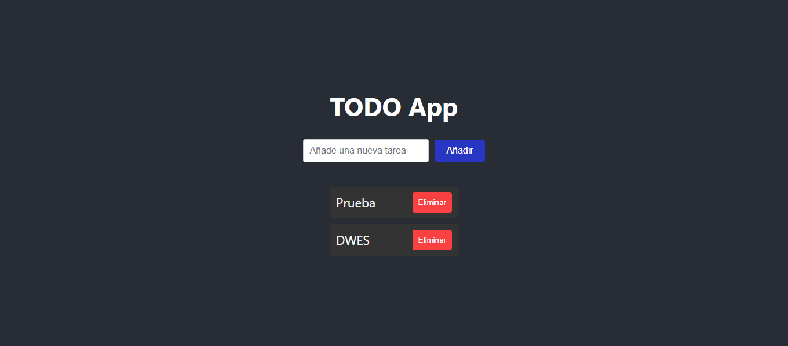

# TAREA Unidad 6: Aplicaciones web dinámicas: PHP y JavaScript

## Índice

- [¿Qué te pedimos que hagas?](#qué-te-pedimos-que-hagas)
	- [Apartado 1. Asincronía en las aplicaciones web](#apartado-1-asincronía-en-las-aplicaciones-web)
	- [Apartado 2. Node.js, npm y Laravel Breeze](#apartado-2-nodejs-npm-y-laravel-breeze)
	- [Apartado 3. Librerías y frameworks JavaScript](#apartado-3-librerías-y-frameworks-javascript)
	- [Apartado 4. Aprende React](#apartado-4-aprende-react)
	- [Apartado 5. Aprende Vue.js (opcional)](#apartado-5-aprende-vuejs-opcional)
- [Evaluación](#evaluación)
- [Criterios de calificación](#criterios-de-calificación)
- [Resultado](#resultado)

 

## ¿Qué te pedimos que hagas?

### Apartado 1. Asincronía en las aplicaciones web

Realiza los siguientes ejercicios:

<ol type="a">
	<li>
		Explica qué es la <a href="https://en.wikipedia.org/wiki/Asynchrony_(computer_programming)">asincronía</a>, la <a href="https://en.wikipedia.org/wiki/Asynchronous_I/O">E/S asíncrona</a> y describe estos dos <a href="https://stackoverflow.com/a/10102768">ejemplos</a>.
	</li>
	<li>
		Define qué es una aplicación web asíncrona y busca, al menos, tres ejemplos reales.
	</li>
	<li>
		Lee, investiga y explica con tus propias palabras lo que es <a href="https://en.wikipedia.org/wiki/Ajax_(programming)">Ajax</a>, para qué sirve y mira este <a href="https://www.youtube.com/watch?v=z2aipCAq2n8">vídeo</a>.
	</li>
	<li>
		Explica este <a href="https://www.w3schools.com/xml/tryit.asp?filename=tryajax_database">ejemplo</a> Ajax que consulta y muestra datos en una base de datos de manera asíncrona.
	</li>
	<li>
		Lee, investiga y explica con tus propias palabras lo que es un <a href="https://en.wikipedia.org/wiki/Single-page_application">SPA</a>.
	</li>
	<li>Lee, investiga y explica con tus propias palabras lo que es un <em><a href="https://www.w3schools.com/whatis/whatis_fullstack.asp">full-stack</a> web developer.</em></li>
</ol>

### Apartado 2. Node.js, npm y Laravel Breeze

Realiza los siguientes ejercicios:

<ol type="a">
	<li>
		Lee, investiga y explica con tus propias palabras lo que es <a href="https://en.wikipedia.org/wiki/Node.js">Node.js</a>.
	</li>
	<li>
		Lee, investiga y explica con tus propias palabras lo que es <a href="https://en.wikipedia.org/wiki/Npm_(software)">npm</a> y mira este <a href="https://www.youtube.com/watch?v=xJzzu7MVZXw">vídeo</a>.
	</li>
	<li>
		Descarga e instala la versión estable LTS de <a href="https://nodejs.org/">Node.js</a>.
	</li>
	<li>
		Comprueba que funciona Node.js y Npm en tu terminal ejecutando <code>node -v</code> y <code>npm -v</code>.
	</li>
	<li>
		Explica qué es <a href="https://laravel.com/docs/starter-kits#laravel-breeze">Laravel Breeze</a> e instala y ejecuta una aplicación web Laravel Breeze de ejemplo.
	</li>
	<li>
		Haz una demo con el ejemplo anterior de Laravel Breeze registrando un usuario e iniciando sesión.
	</li>
</ol>

### Apartado 3. Librerías y frameworks JavaScript

Realiza los siguientes ejercicios:

<ol type="a">
	<li>
		Lee, investiga y explica con tus propias palabras lo que es una <a href="https://en.wikipedia.org/wiki/JavaScript_library">librería JavaScript</a>.
	</li>
	<li>
		Lee, investiga y explica con tus propias palabras lo que es un <a href="https://en.wikipedia.org/wiki/JavaScript_framework">framework JavaScript</a>.
	</li>
	<li>
		Di en qué se diferencia una librería JS de un framework JS y nombra tres ejemplos de cada uno.
	</li>
	<li>
		Lee, investiga y explica con tus propias palabras lo que es una <a href="https://en.wikipedia.org/wiki/React_(JavaScript_library)">React</a>.
	</li>
	<li>
		Lee, investiga y explica con tus propias palabras lo que es un <a href="https://en.wikipedia.org/wiki/Angular_(web_framework)">Angular</a>.
	</li>
	<li>
		Lee, investiga y explica con tus propias palabras lo que es un <a href="https://en.wikipedia.org/wiki/Vue.js">Vue.js</a>.
	</li>
</ol>

### Apartado 4. Aprende React

Entra en la página oficial de [React](https://reactjs.org/) y visualiza este [vídeo](https://www.youtube.com/watch?v=1-2eyS0k-IA).

Practica los principales [conceptos](https://reactjs.org/docs/hello-world.html) de React:

<ol>
	<li>
		<a href="https://reactjs.org/docs/hello-world.html">Hello World</a> (<a href="https://es.reactjs.org/docs/hello-world.html">español</a>).
		</li>
	<li>
		<a href="https://reactjs.org/docs/introducing-jsx.html">Introducing JSX</a> (<a href="https://es.reactjs.org/docs/introducing-jsx.html">español</a>).
	</li>
	<li>
		<a href="https://reactjs.org/docs/rendering-elements.html">Rendering Elements</a> (<a href="https://es.reactjs.org/docs/rendering-elements.html">español</a>).
	</li>
	<li>
		<a href="https://reactjs.org/docs/components-and-props.html">Components and Props</a> (<a href="https://es.reactjs.org/docs/components-and-props.html">español</a>).
	</li>
	<li>
		<a href="https://reactjs.org/docs/state-and-lifecycle.html">State and Lifecycle</a> (<a href="https://es.reactjs.org/docs/state-and-lifecycle.html">español</a>).
	</li>
	<li>
		<a href="https://reactjs.org/docs/handling-events.html">Handling Events</a> (<a href="https://es.reactjs.org/docs/handling-events.html">español</a>).
	</li>
	<li>
		<a href="https://reactjs.org/docs/conditional-rendering.html">Conditional Rendering</a> (<a href="https://es.reactjs.org/docs/conditional-rendering.html">español</a>).
	</li>
	<li>
		<a href="https://reactjs.org/docs/lists-and-keys.html">Lists and Keys</a> (<a href="https://es.reactjs.org/docs/lists-and-keys.html">español</a>).
	</li>
	<li>
		<a href="https://reactjs.org/docs/forms.html">Forms</a> (<a href="https://es.reactjs.org/docs/forms.html">español</a>).
	</li>
	<li>
		<a href="https://reactjs.org/docs/lifting-state-up.html">Lifting State Up</a> (<a href="https://es.reactjs.org/docs/lifting-state-up.html">español</a>).
	</li>
	<li>
		<a href="https://reactjs.org/docs/composition-vs-inheritance.html">Composition vs Inheritance</a> (<a href="https://es.reactjs.org/docs/composition-vs-inheritance.html">español</a>).
	</li>
	<li>
		<a href="https://reactjs.org/docs/thinking-in-react.html">Thinking In React</a> (<a href="https://es.reactjs.org/docs/thinking-in-react.html">español</a>).
	</li>
</ol>

Por último, lee este [artículo](https://www.ribosomatic.com/articulos/ajax-con-react-js-php-mysql/) y ejecuta su [ejemplo](https://github.com/RibosoMaticCode/react-php-mysql): **PHP + MySQL con una llamada Ajax usando React**.

### Apartado 5. Aprende Vue.js (opcional)

Entra en la página oficial de [Vue](https://v3.vuejs.org/) y visualiza el vídeo **Why Vue.js**.

Completa este [curso](https://www.vuemastery.com/courses/intro-to-vue-3/intro-to-vue3) introductorio:

<ol>
	<li>
		<a href="https://www.vuemastery.com/courses/intro-to-vue-3/intro-to-vue3">Intro to Vue 3</a>
		</li>
	<li>
		<a href="https://www.vuemastery.com/courses/intro-to-vue-3/creating-the-vue-app-vue3">The Vue App</a>
	</li>
	<li>
		<a href="https://www.vuemastery.com/courses/intro-to-vue-3/attribute-binding-vue3">Attribute Binding</a>
	</li>
	<li>
		<a href="https://www.vuemastery.com/courses/intro-to-vue-3/conditional-rendering-vue3">Conditional Rendering</a>
	</li>
	<li>
		<a href="https://www.vuemastery.com/courses/intro-to-vue-3/list-rendering-vue3">List Rendering</a>
	</li>
	<li>
		<a href="https://www.vuemastery.com/courses/intro-to-vue-3/event-handling-vue3">Event Handling</a>
	</li>
	<li>
		<a href="https://www.vuemastery.com/courses/intro-to-vue-3/class-and-style-binding-vue3">Class & Style Binding</a>
	</li>
	<li>
		<a href="https://www.vuemastery.com/courses/intro-to-vue-3/computed-properties-vue3">Computed Properties</a>
	</li>
	<li>
		<a href="https://www.vuemastery.com/courses/intro-to-vue-3/components-and-props-vue3">Components & Props</a>
	</li>
	<li>
		<a href="https://www.vuemastery.com/courses/intro-to-vue-3/communicating-events-vue3">Communicating Events</a>
	</li>
	<li>
		<a href="https://www.vuemastery.com/courses/intro-to-vue-3/forms-and-v-model-vue3">Forms & v-model</a>
	</li>
</ol>

El procedimiento a realizar en cada lección es el siguiente:

1. Visiona el vídeo y activa los subtítulos.
2. Lee el contenido y completa la lección.
3. Resuelve el reto (_challenge_).

## Evaluación

1. La estructura de archivos y carpetas debe quedar [así](https://milq.github.io/cursos/dwes/ud/6/estructura.txt).

## Criterios de calificación

- **Actividades 1, 2 y 3**: hasta 5 puntos.
- **Actividad 4 (React)**: hasta 5 puntos.

---

## Resultado

**Calificación**: 9,00 / 10,00

Calificado el jueves, 2 de junio de 2022, 17:39 por López Quintero, Manuel Ignacio

**Comentarios de retroalimentación**:
- Actividades 1, 2 y 3: 4 puntos. 
- Actividad 4 (React): 5 puntos. 
- Actividad de foro: Sí. 
