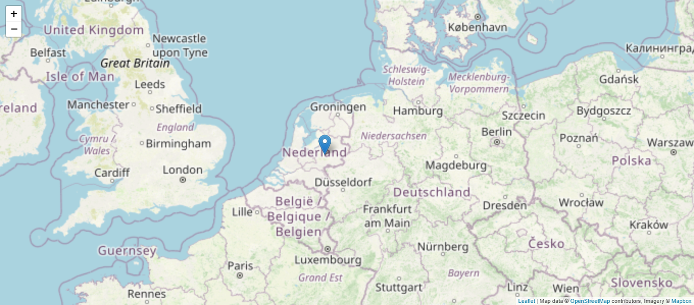

# Enunciado

1. Realiza tres sitios web:

	c. Uno que use [Leaflet](https://github.com/Leaflet/Leaflet) con Open Street Maps y/o Google Maps y crear así una aplicación web híbrida de tipo (mashup)[https://en.wikipedia.org/wiki/Mashup_(web_application_hybrid)]; para ello, ayúdate de este [tutorial](https://www.latirus.com/blog/2021/06/11/instalar-google-maps-y-leaflet-js-en-laravel/) ([vídeo](https://www.youtube.com/watch?v=_ieQavKU4AY)).