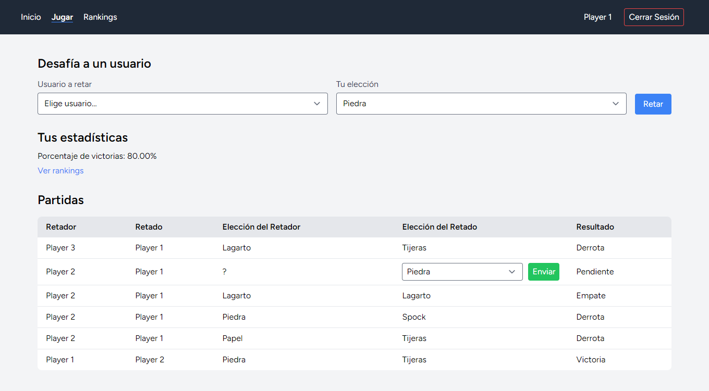
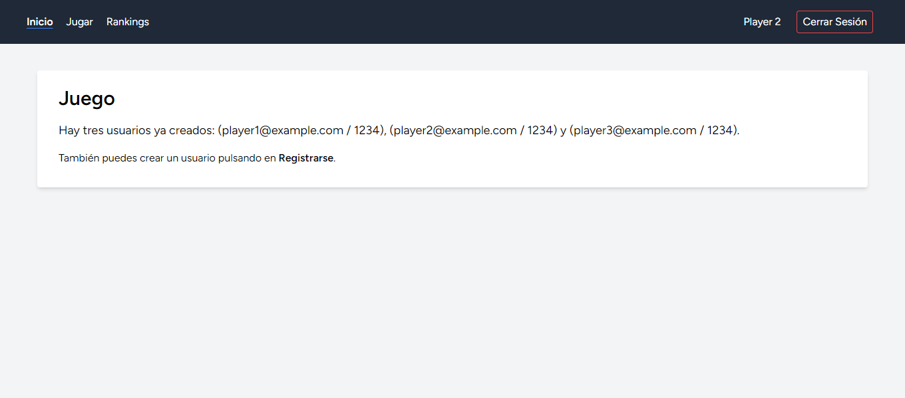
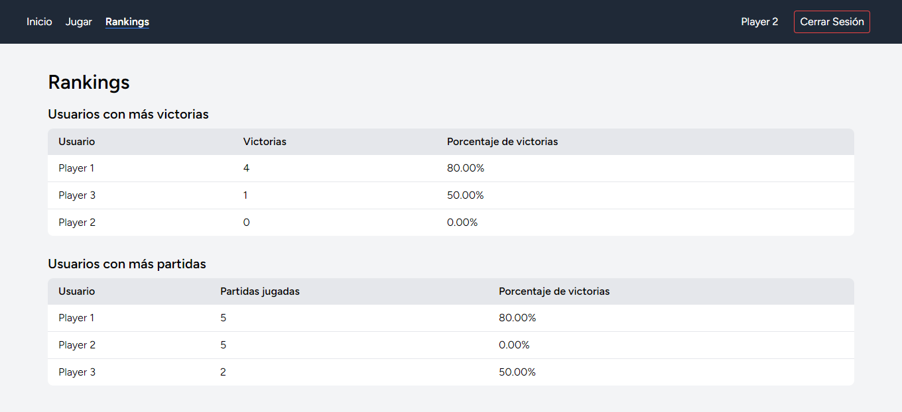

	
	&nbsp;
	

	
	&nbsp;
	

# Enunciado

10. Crea el juego de piedra, papel, tijeras, lagarto o Spock entre usuarios. El usuario retará a otro usuario y elegirá una de esas cinco opciones. El usuario retado verá una petición de reto, elegirá una de esas cinco opciones y se producirá un resultado para el retador y el retado. Cada usuario puede ver su historial de partidas jugadas así como su porcentaje de victorias. También podrá ver dos clasificaciones: usuarios más ganadores y usuarios con más partidas; ambas clasificaciones acompañadas de nombre de usuario y porcentaje de victoria.
