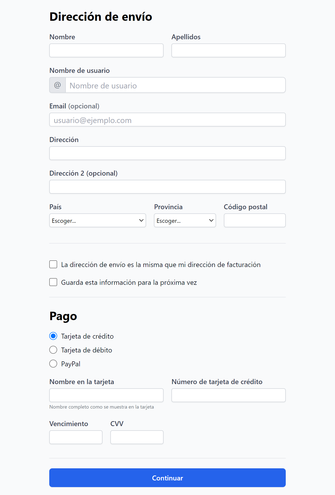
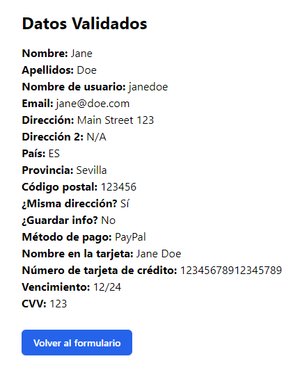
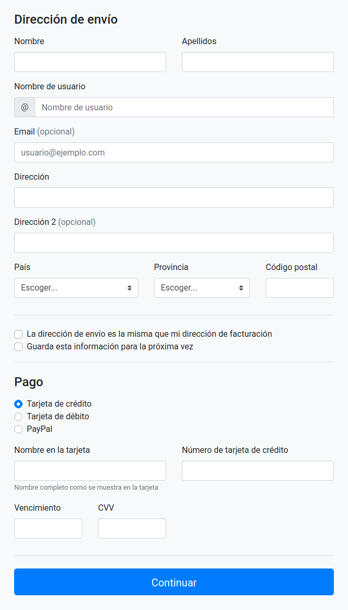

	
	&nbsp;
	

 

# Enunciado

2. Crea el siguiente [formulario](https://milq.github.io/cursos/dwes/ud/7/formulario.png) y que dichos datos se recojan, se validen de forma segura en servidor y se muestren en otra vista.

