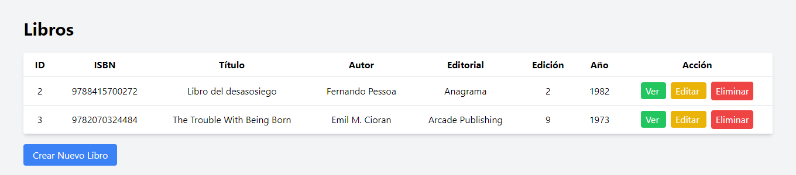
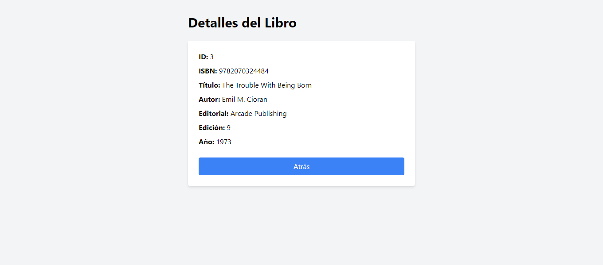
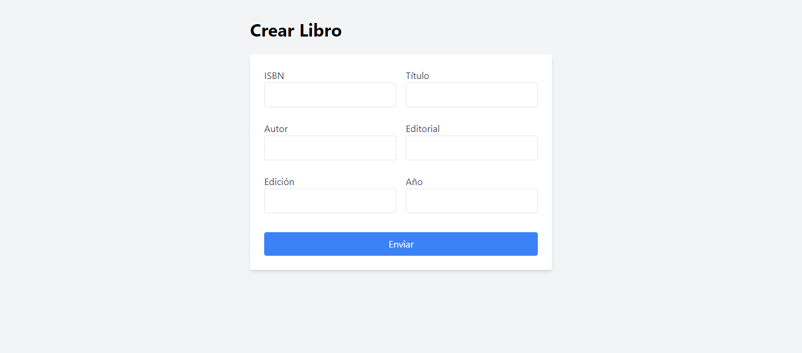
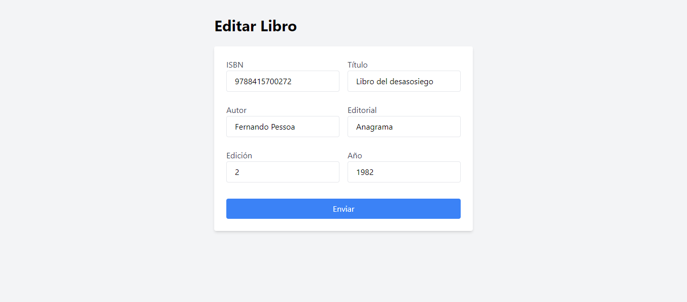

# Enunciado

3. Crea una aplicación web [CRUD](http://en.wikipedia.org/wiki/create,_read,_update_and_delete) sencilla sobre libros (id, ISBN, título, autor, editorial, edición, año). Ayúdate de este [tutorial](https://milq.github.io/cursos/dwes/ud/3/laravel).
