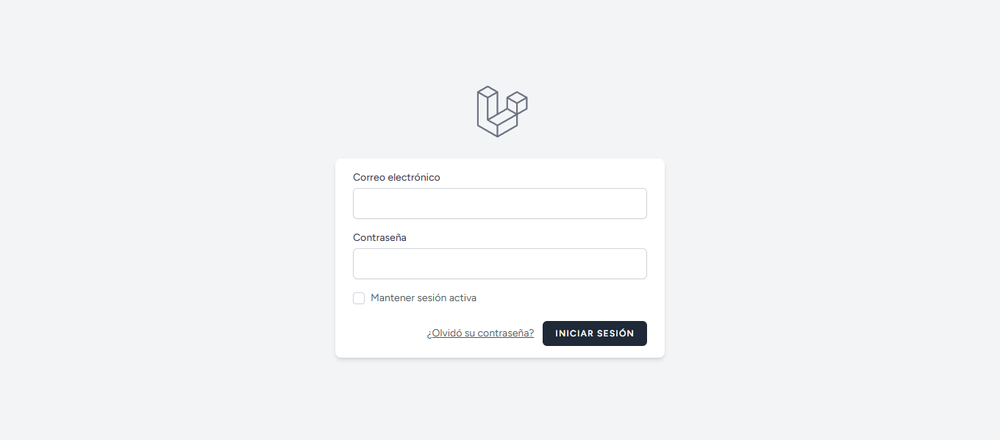

	
	&nbsp;
	

	
	&nbsp;
	

# Enunciado

4. Crea un informe de salud personal. Habrá que registrarse como usuario y después iniciar sesión. Una vez iniciado, el usuario introducirá su sexo, edad, altura y peso y al pulsar en *Calcular* se validarán los datos y se generará un informe de salud con el [IMC](https://es.wikipedia.org/wiki/%C3%8Dndice_de_masa_corporal) y el metabolismo basal según la [fórmula](https://es.wikipedia.org/wiki/Metabolismo_basal#C%C3%A1lculo_de_calor%C3%ADas_necesarias) de la OMS.
