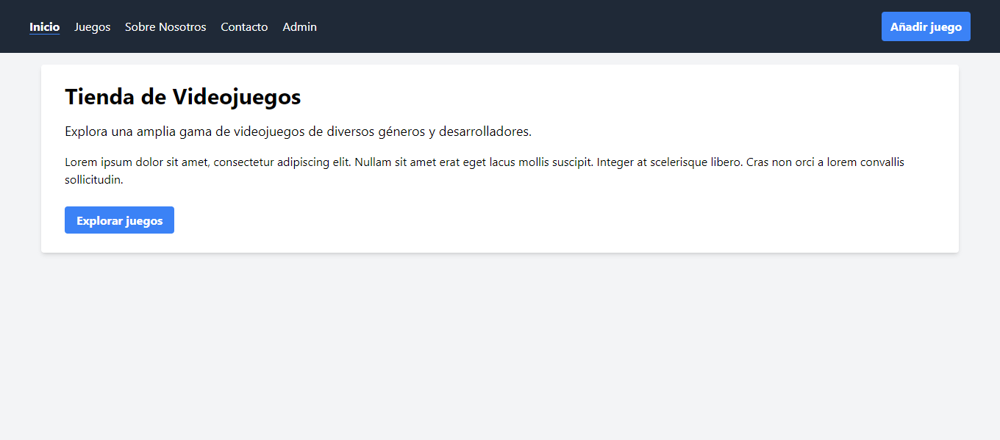
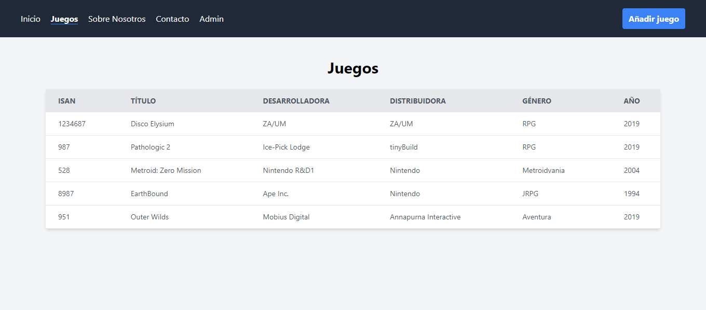
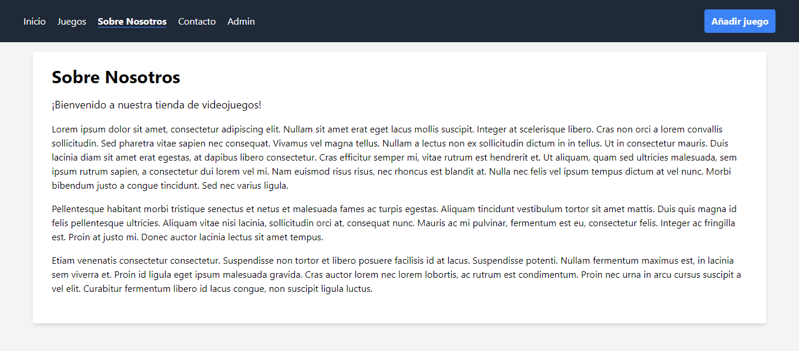
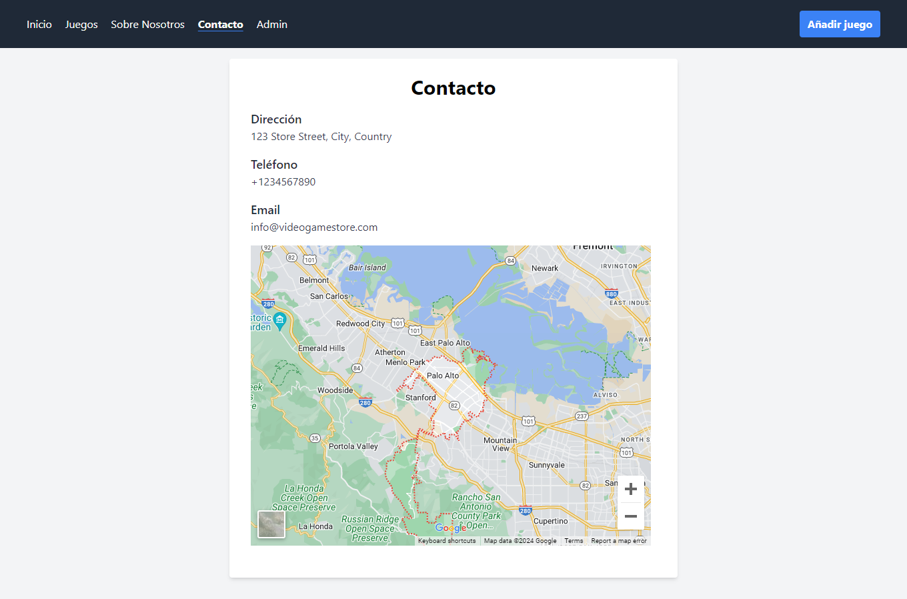
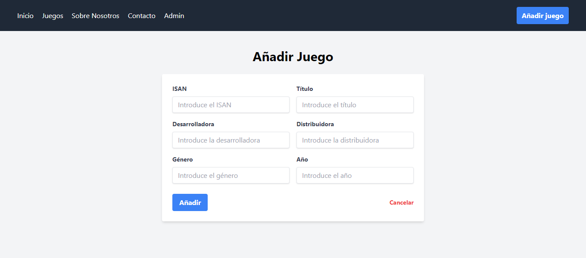
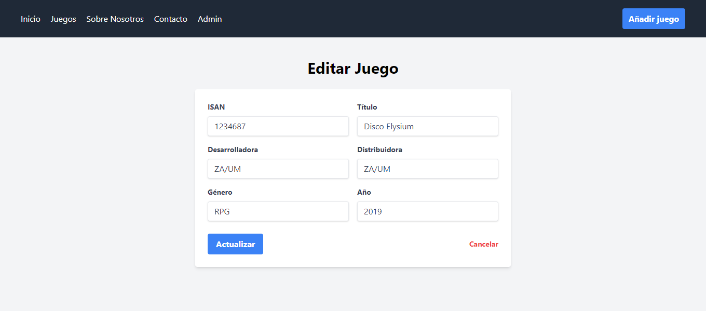
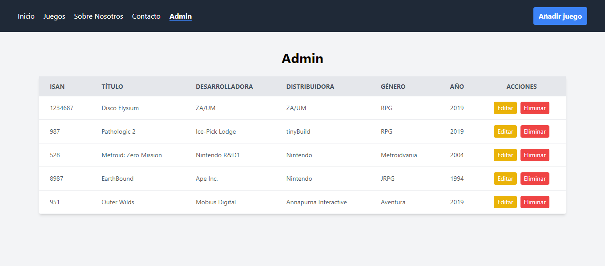

	
	&nbsp;
	

	
	&nbsp;
	

	
	&nbsp;
	

# Enunciado

5. Crea una tienda [CRUD](http://en.wikipedia.org/wiki/create,_read,_update_and_delete) de videojuegos (*ISAN*, título, desarrolladora, distribuidora, género, año) con las pestañas **Inicio** (presentación de la tienda), **Juegos** (juegos almacenados en la tienda), **Sobre nosotros** (descripción de la tienda), **Contacto** (datos de contacto y localización) y **Admin**. Ésta última con tres subpestañas: **Añadir** (inserción de un videojuego), **Editar** (modificación de los campos de un videojuego) y **Borrar** (eliminación de un videojuego).