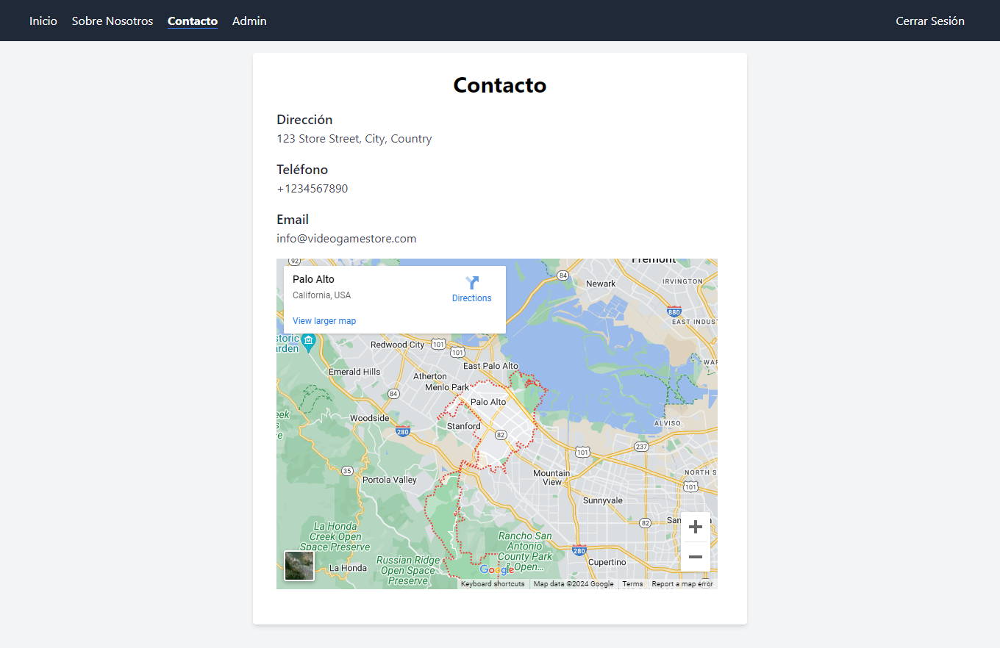

	
	&nbsp;
	

	
	&nbsp;
	

	
	&nbsp;
	

	
	&nbsp;
	

# Enunciado

6. Repite la actividad anterior con las pestañas **Registrar** (como usuario cliente) e **Iniciar sesión** (como usuario cliente o administrador). Si no se ha iniciado sesión, se podrá acceder a *Inicio*, *Sobre nosotros* y *Contacto*. Si se ha iniciado sesión como cliente, se podrá acceder a *Juegos* y si es como administrador, se podrá gestionar los videojuegos en *Admin*.