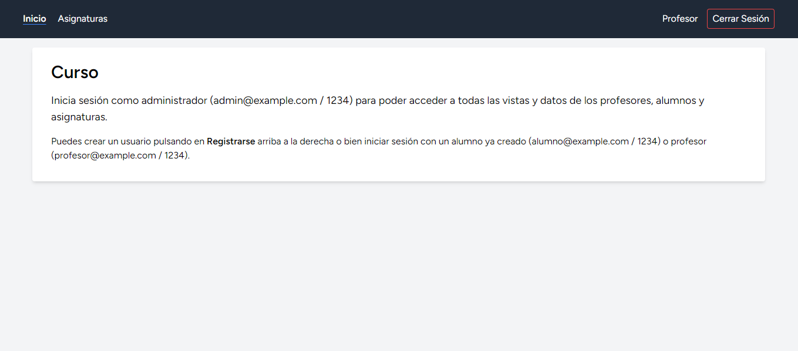

	
	&nbsp;
	

	
	&nbsp;
	

	
	&nbsp;
	

	
	&nbsp;
	

# Enunciado

8. Crea un curso sencillo con este [modelo](https://milq.github.io/cursos/dwes/ud/7/modelo_curso.png) (relaciones [uno a varios](https://laravel.com/docs/eloquent-relationships#one-to-many) y [varios a varios](https://laravel.com/docs/eloquent-relationships#many-to-many)). Puedes registrarte como alumno, como profesor (*1234* como clave para poder registrarte como profesor) pero no como administrador. El profesor, una vez iniciado sesión correctamente, introducirá, mediante formularios, las asignaturas que imparte. El alumno, una vez iniciado sesión correctamente, podrá inscribirse en las diferentes asignaturas. El administrador visualizará todo.

--- 

## Notas

- En vez de crear la tabla `profesor` y `alumno`, he aglutinado ambas en `user` añadiendo la columna `role`. De la forma en la que se plantea el ejercicio, no tiene sentido tener dos tablas idénticas con la misma estructura. De la forma en la que lo he hecho, se siguen conservando las relaciones planteadas en la tarea, con la diferencia de que ahora la relación uno a muchos es entre `user` y `asignatura` y la relación muchos a muchos entre `user` y `asignatura` con una tabla pivot llamada `alumno_asignatura`.
- Por norma general, no hago ejercicios con código en español, pero como el modelo que se da en el ejercicio lo está, he nombrado propiedades y clases acorde al material aportado por el profesor para evitar confusión.