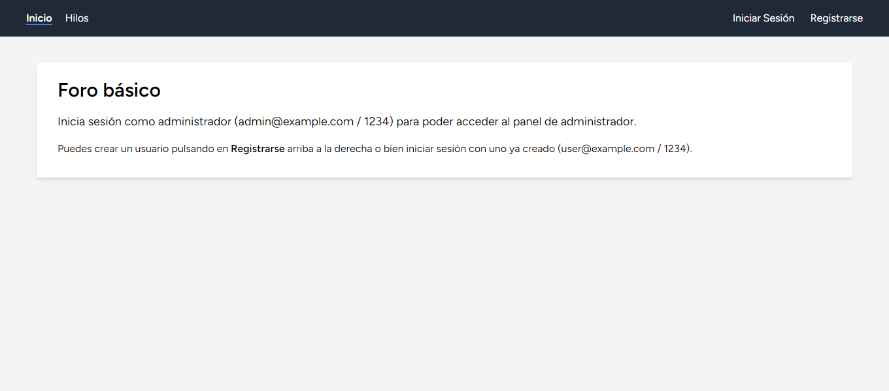
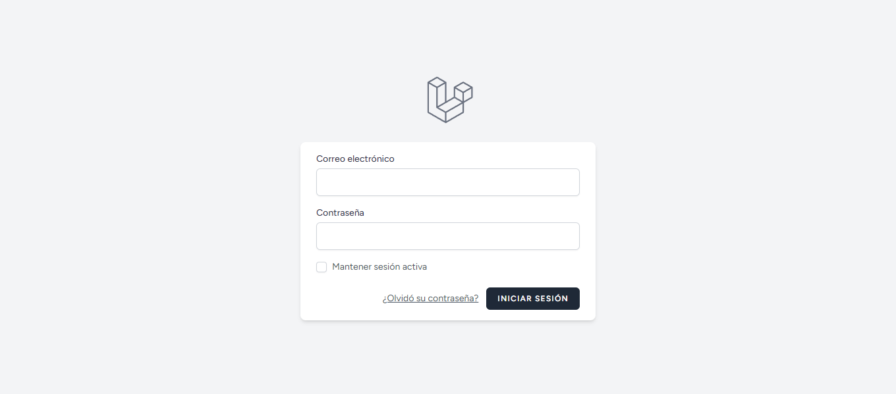
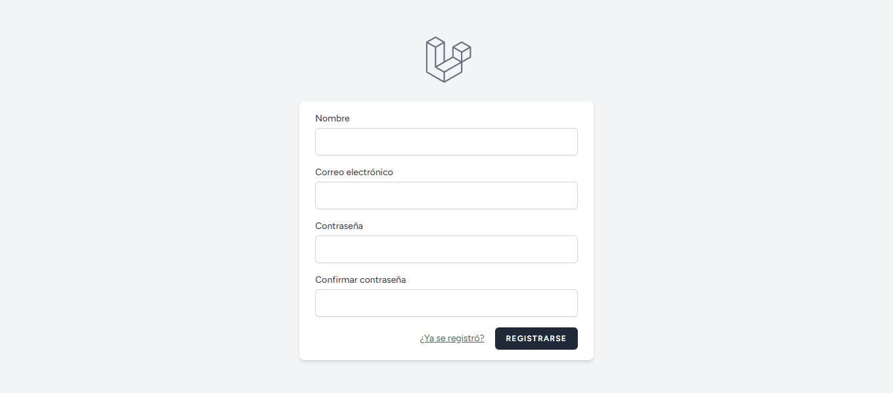
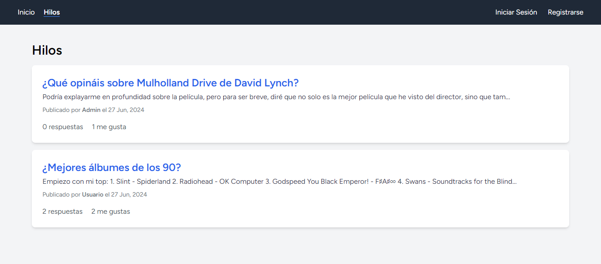
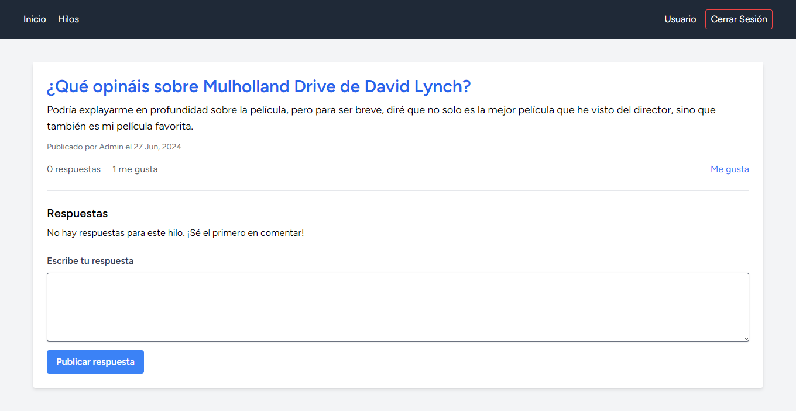
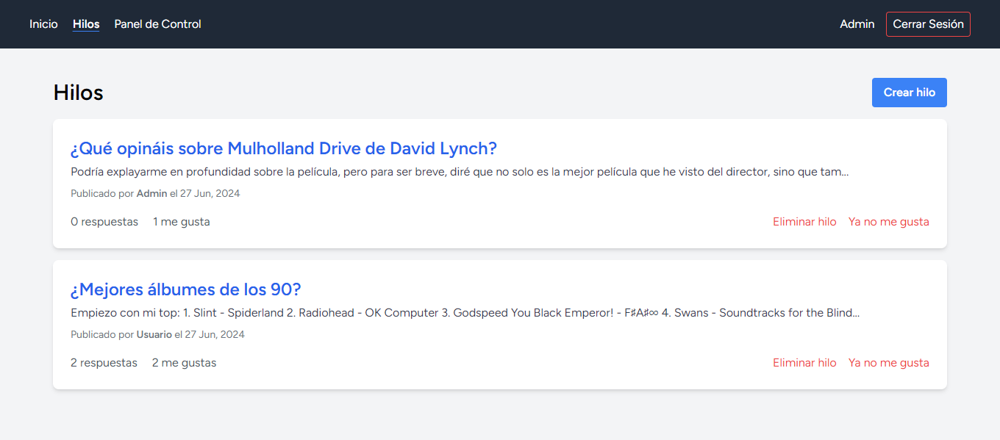
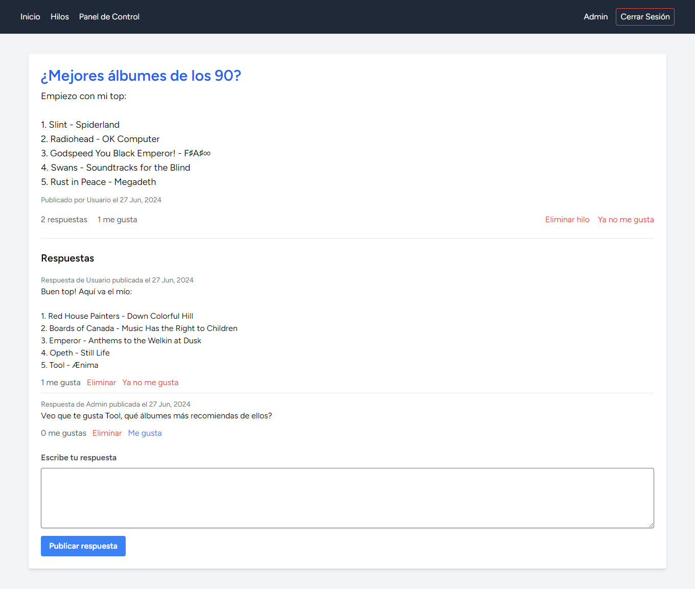
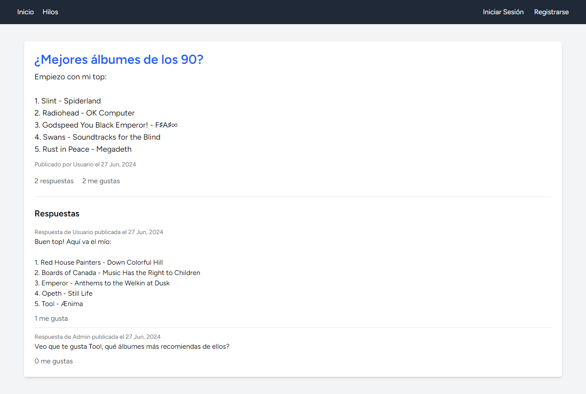
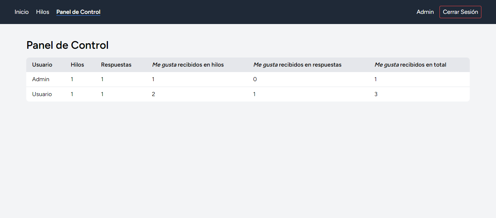
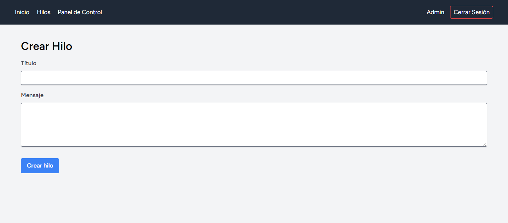

	
	&nbsp;
	

	
	&nbsp;
	

	
	&nbsp;
	

	
	&nbsp;
	

	
	&nbsp;
	

# Enunciado

9. Elige y realiza en Laravel [uno](https://milq.github.io/cursos/dwes/ud/2/index.html#a) o [uno](https://milq.github.io/cursos/dwes/ud/4/index.html#b) del que más te guste y que no hayas hecho anteriormente.

## Enunciado del ejercicio elegido ([foro básico](https://milq.github.io/cursos/dwes/ud/4/index.html#b))

El usuario (cliente) se registrará, iniciará sesión y abrirá un hilo de conversación, responderá en otro hilo de conversación ya existente y/o dará _me gusta_ a un hilo o respuesta. El administrador iniciará sesión y podrá comprobar el número de mensajes de cada usuario y el número de _me gusta_ en total recibidos. El administrador también podrá iniciar hilos y responder a hilos.
