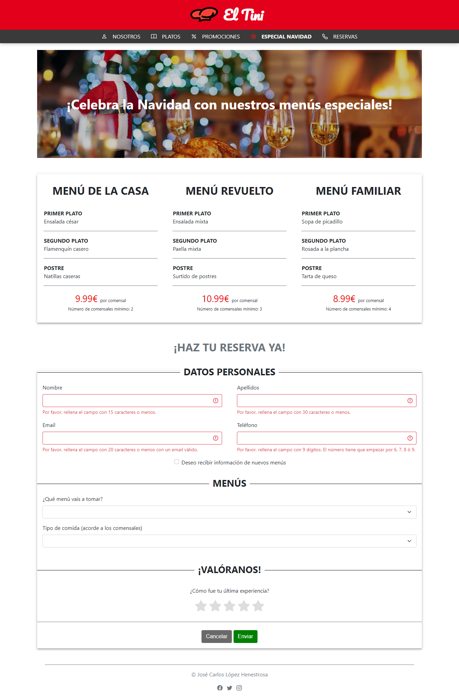
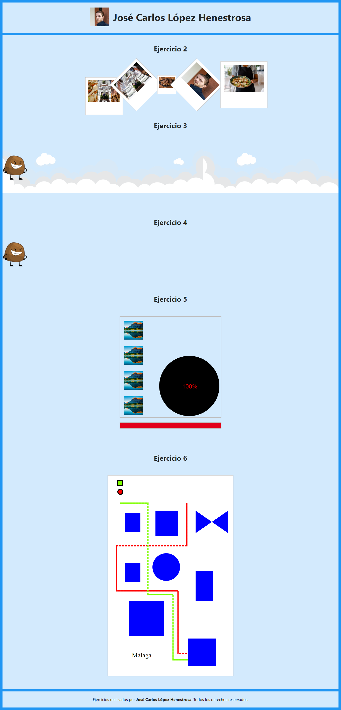

# Diseño de Interfaces Web

>[!NOTE]
>Pulsa sobre el enlace a un ejercicio para ver el código fuente o haz click en su imagen para abrir una página web con el ejercicio desplegado.

<table>
	<tr>
		<th>UNIDAD</th>
		<th>CAPTURA DE LA TAREA</th>
		<th>CALIFICACIÓN DE LA TAREA</th>
	</tr>
	<tr>
		<td>
			<a href="https://github.com/HenestrosaDev/2-daw/tree/main/diseno_de_interfaces_web/u1">
				1. Planificación de interfaces gráficas
			</a>
		</td>	
		<td>
			<em>Se compone de 7 ejercicios realizados en formato PDF.</em>
		</td>
		<td>6,45 / 10,00</td>
	</tr>
	<tr>
		<td>
			<a href="https://github.com/HenestrosaDev/2-daw/tree/main/diseno_de_interfaces_web/u2">
				2. Accesibilidad y usabilidad en la web
			</a>
		</td>
		<td>
			
		</td>
		<td>8,50 / 10,00</td>
	</tr>
	<tr>
		<td>
			<a href="https://github.com/HenestrosaDev/2-daw/tree/main/diseno_de_interfaces_web/u3">
				3. Hojas de estilos
			</a>
		</td>
		<td>
			
		</td>
		<td>9,30 / 10,00</td>
	</tr>
	<tr>
		<td>
			<a href="https://github.com/HenestrosaDev/2-daw/tree/main/diseno_de_interfaces_web/u4">
				4. Contenidos multimedia en la web: imágenes, audio y vídeo
			</a>
		</td>
		<td>
			
		</td>
		<td>9,75 / 10,00</td>
	</tr>
	<tr>
		<td>
			<a href="https://github.com/HenestrosaDev/2-daw/tree/main/diseno_de_interfaces_web/u5">
				5. Contenidos multimedia en la web: animaciones
			</a>
		</td>
		<td>
			
		</td>
		<td>9,00 / 10,00</td>
	</tr>
	<tr>
		<td>
			<a href="https://github.com/HenestrosaDev/2-daw/tree/main/diseno_de_interfaces_web/u6">
				6. Contenidos web interactivos
			</a>
		</td>
		<td>
			
		</td>
		<td>8,85 / 10,00</td>
	</tr>
	<tr>
		<td colspan="2"></td>
		<td></td>
	</tr>
	<tr>
		<td colspan="2">
			<strong>CALIFICACIÓN MEDIA</strong>
		</td>
		<td>8,64 / 10,00</td>
	</tr>
</table>