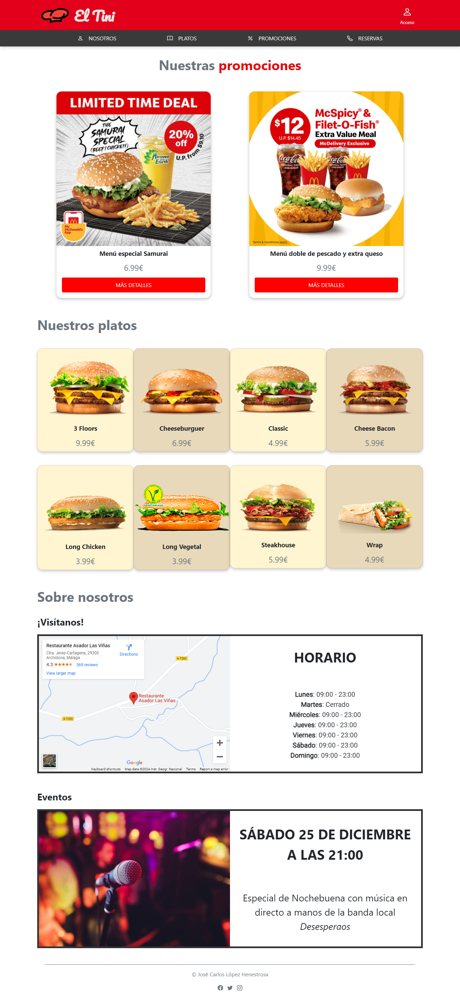
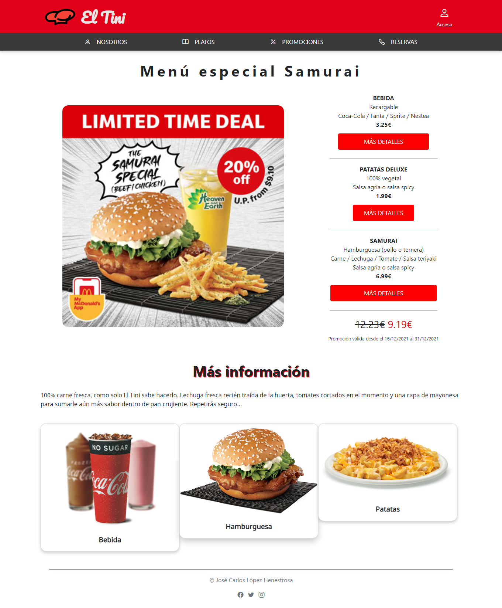

	
	&nbsp;
	

# TAREA Unidad 3: Hojas de estilos

## Índice

- [TARA Unidad 3: Hojas de estilos](#tara-unidad-3-hojas-de-estilos)
	- [Índice](#índice)
	- [¿Qué te pedimos que hagas?](#qué-te-pedimos-que-hagas)
		- [Apartado 1. Planificación inicial](#apartado-1-planificación-inicial)
		- [Apartado 2. Página principal (`index.html`)](#apartado-2-página-principal-indexhtml)
		- [Apartado 3. Página promociones (`promociones.html`)](#apartado-3-página-promociones-promocioneshtml)
		- [Apartado 4. Test](#apartado-4-test)
	- [Detalles a tener en cuenta](#detalles-a-tener-en-cuenta)
	- [Resultado](#resultado)

 

## ¿Qué te pedimos que hagas?

Vamos a desarrollar una web responsiva la cual tendrá un diseño para dispositivos con menos de 768px de ancho y otro diseño para dispositivos con una resolución igual o mayor a 768px. Los elementos que conforman nuestra página deben adaptarse a dichas resoluciones de forma que la visibilidad y legibilidad de los mismos sea correcta en todo momento.

Consideraciones a tener en cuenta:

- Las tablas no deben utilizarse como elemento de maquetación, en caso de utilizarlas no se valorará y todo lo relacionado con ellas no tendrá puntuación o tendrá penalización.
- Deben utilizarse el máximo de etiquetas semánticas en **HTML5**.
- La composición final debe quedar equilibrada y debe cuidarse la estética.
- Los textos deben ser legibles en cualquiera de las resoluciones, siendo proporcionados en función de las resoluciones de los dispositivos.

Nuestra web estará formada por dos páginas web:

- Página web principal (`index.html`).
- Página relacionada con las promociones (`promociones.html`).

Antes de comenzar a detallar los requisitos de nuestra página, indicar que junto con el desarrollo hay que entregar un documento PDF donde se piden diferentes cuestiones como capturas de pantalla. En dicho documento se pueden realizar todas las observaciones que se deseen, para fundamentar y razonar el desarrollo. Al final de este apartado se indica de forma más detallada el mínimo de puntos que debe contener este documento y como llamarse.

En toda la tarea se juega con un punto de ruptura en el que se modificará el diseño de nuestra página web, este valor es 768px, si se quiere cambiar por otro valor se puede realizar, pero habrá que indicarlo y justificarlo. El nuevo valor que se haya seleccionado será el que habrá que tener en cuenta en lugar de 768px.

Se ha intentado utilizar los colores en el enunciado de la tarea para diferenciar lo que se pide en cada página y posteriormente diferenciar lo relacionado con cada resolución.

Los requisitos de nuestra página web se describirán de forma general y posteriormente se detallarán los elementos que serán visibles y sus características para cada una de las diferentes resoluciones con las que vamos a trabajar (**menos de 768px** y **768px o más**).

### Apartado 1. Planificación inicial

Como punto de partida para cualquier desarrollo, es conveniente realizar una pequeña planificación, por lo tanto, para ayudarnos con nuestra tarea se pide:

- Un boceto a grandes rasgos (sencillo) del diseño de la página principal (`index.html`). Para ello debes plantear un diseño para la versión completa y otro para la versión de **menos de 768px**. Estos dos diseños debes incluirlos en el documento pdf que entregues de la tarea, con las explicaciones que consideres oportunas.
- Dentro de una **guía de estilo**, un aspecto importante son las **fuentes**, por lo que te pedimos que indiques en detalle las distintas fuentes que vas a utilizar en esta web, indicando en qué partes se utilizarán y cuáles son sus características principales (origen, nombre, color, tamaño, estilo, etc).

### Apartado 2. Página principal (`index.html`)

Se describen las características de nuestra web:

- **Cabecera**
	- Logotipo de nuestra empresa.
	- Nombre de nuestra empresa (no debe ser una imagen que forme parte del logotipo).
	- Icono con un texto al lado que ponga **Identifícate**. Al pasar por encima del icono o el texto, este debe cambiar de color (icono y texto).
- **Zona de navegación**. Deberá tener las siguientes opciones que se visualizarán de forma diferente dependiendo de la resolución del dispositivo:
	- Nosotros.
	- Platos.
	- **Promociones**: Al hacer click en esta opción, iremos a la página `promociones.html`.
	- Reservas.
- **Zona de contenido**
	- **Zona de promoción**. Debe ser llamativa y debe contener los siguientes elementos:
		- Nombre de la promoción.
		- Una imagen de la promoción. Debe tener un borde con forma elíptica.
		- Precio.
		- Efecto sobre el precio: Al pasar por encima del precio debe aparecer el periodo en el que se aplica la promoción.
		- **Más detalles…**: Al hacer click sobre esta opción, habrá que ir a la página `promociones.html`. Esta opción puede sustituirse por una imagen o un icono si así se desea.
	- **Zona de platos**. El número de platos que se mostrará dependerá de la resolución del dispositivo. Cada producto debe estar formado por:
		- Imagen.
		- Nombre del plato.
		- Precio.
	- **Bloques de información**. Se mostrarán al menos dos bloques de información. Cada bloque debe contener:
		- Título.
		- Imagen.
		- Texto: Tendremos que utilizar una tipografía importada desde algún sitio web (por ejemplo, Google Fonts).
- **Pie de página**
	- Incluir iconos de al menos tres redes sociales.

El diseño de la página principal en dispositivos con menos de 768px deben tenerse en cuenta las siguientes indicaciones:

- **Zona de navegación**: Las opciones deberán mostrarse con iconos o imágenes.
- **Platos**: Deberán aparecer solo 4 platos. Debe haber un plato por línea, es decir, debe aparecer uno debajo de otro (con los elementos que se han descrito anteriormente: imagen, nombre y precio).
- **Bloques de información**: Solo debe aparecer un bloque de información, el relacionado con la localización del restaurante.

Para el diseño de la página principal en dispositivos con una resolución igual o mayor a 768px, deben tenerse en cuenta las siguientes indicaciones:

- **Platos**: Deben aparecer 8 platos distribuidos en 2 filas con cuatro platos cada una. El fondo de los productos pares debe ser diferente al fondo de los productos impares y deben utilizarse colores con diferente opacidad (por ejemplo utilizando RGBA). Para colorear los fondos pares e impares debe utilizarse el mínimo número de reglas CSS posibles.
- **Bloques de información**: Debe aparecer dos bloques de información: el relacionado con la localización del restaurante y otro más.

### Apartado 3. Página promociones (`promociones.html`)

Al acceder a la opción del menú **Promociones** o cuando hagamos click en la opción **Más detalles…** de cualquiera de las promociones que aparece en la página principal, deberemos ir a una nueva página denominada `discos.html`, también debe ser responsiva y debe tener los siguientes elementos:

- **Encabezado, zona de navegación y pie de página**: Estos elementos deben tener las mismas características que los descritos en la página principal.
- **Zona de contenido**: Se dividirá en dos bloques y la visualización de los mismos dependerá de la resolución del dispositivo.
	- **Zona de contenido BLOQUE 1**
		- **Nombre de la promoción**: La separación entre las letras del nombre de la promoción debe ser de 8px.
		- **Imagen de la promoción**: Se debe aplicar un filtro que produzca un efecto vistoso al pasar por encima de la imagen.
		- **Condiciones de la promoción**.
		- Debemos mostrar una tabla con los platos que incluyen en la promoción, mostrándose la siguiente información (utilizar la máxima semántica en el HTML):
			- **Nombre del plato**: Mediante CSS el nombre del plato debe estar en mayúsculas.
			- Botón para ir a la descripción del plato.
			- Tipo de plato (entrante, verduras, carne, pescado o postre).
			- Precio normal.
			- Ingredientes principales.
			- Debe mostrarse una fila de totales, donde se vea: el precio total de todos los platos en condiciones normales y el precio total de la promoción.
	- **Zona de contenido BLOQUE 2**. Debe contener los siguientes elementos y solo se visualizará en dispositivos con una resolución **igual o mayor a 768px**:
		- El título **Más información** al que se le debe aplicar una sombra atractiva al texto.
		- Reseña descriptiva de la promoción. La fuente utilizada para este campo debe haberse obtenido de algún lugar de internet y descargada a nuestro sitio web. Para utilizarla hay que hacer referencia a los ficheros descargados de forma local.
		- **Fotografías de los platos**: Deberá tener como mínimo 3 imágenes.

Para el diseño de la página principal en dispositivos con **menos de 768px** deben tenerse en cuenta las siguientes indicaciones:

- **BLOQUE 1**
	- Deben aparecer todos los elementos citados con la estructura que se quiera.
	- **Tabla**: Solo deben mostrarse las dos primeras columnas de información (nombre del plato y botón para ir a la descripción).
- **BLOQUE 2**
	- No debe visualizarse.

Para el diseño de la página principal en dispositivos una resolución igual o mayor a 768px deben tenerse en cuenta las siguientes indicaciones:

- Mostrar la información en dos bloques paralelos (es decir, uno al lado del otro; BLOQUE 1 a la izquierda y BLOQUE 2 a la derecha).
- **BLOQUE 1**
	- Deben aparecer todos los elementos citados con la estructura que se quiera.
	- Tabla: Deben mostrarse todas las columnas citadas.
- **BLOQUE 2**
	- Debe visualizarse según las indicaciones dadas.

### Apartado 4. Test

Finalizado nuestro desarrollo debemos asegurarnos que éste es correcto, para ello vamos a usar **validadores de HTML y CSS**. Debes validar las páginas creadas tanto a nivel de **HTML** como de **CSS**, utilizando las siguientes herramientas:

- [Esquema HTML5 correcto](https://validator.w3.org/).
- [Esquema CSS correcto](https://jigsaw.w3.org/css-validator/).
- Los códigos no deben contener errores. Adjunta captura de pantalla en documento donde se pueda comprobar que el código es totalmente correcto. Si no fuera así, habría que justificar por qué aparece algún error.
- En caso de utilizar otros validadores debes consultarlo con el profesor de forma privada por correo.

## Detalles a tener en cuenta

Habrá que entregar los ficheros (de forma organizada) con el desarrollo realizado y un documento en formato pdf denominado `Tarea_03.pdf` donde se adjunte lo siguiente:

- Los bocetos de las dos resoluciones.
- La definición del estilo en relación a las fuentes.
- Las capturas de pantalla de las dos páginas en las diferentes resoluciones (indicar el navegador utilizado).
- Los resultados obtenidos en los test.
- Todas aquellas justificaciones o decisiones que se hayan tomado y que puedan ayudar a la compresión y corrección de la tarea.
 
**IMPORTANTE**: Para todo el desarrollo se valorará:

- Los estilos utilizados, incluyendo aquellos referentes a fondos, bordes, colores, fuentes, etc., vistos en la unidad.
- Todos los elementos de nuestras páginas (imágenes, texto, etc.) deben verse de forma correcta y proporcionada en las diferentes resoluciones que describe el enunciado de la tarea.
- Se debe ser óptimo y utilizar el mínimo de código y reglas CSS.
- Todos los estilos personalizados que apliquemos a nuestra web, deben estar en una hoja de estilos externa y deben encontrarse en un directorio propio destinado a estilos.
- Solo estarán permitidos los estilos creados por el alumno o alumna.
- No deben incluirse más elementos que los indicados en el enunciado, en caso de incluir algún nuevo elemento debe consultarse previamente con el profesor y debe tener una justificación. En caso contrario la zona o parte de la tarea relacionada no se tendrá en cuenta.
- Todos los ficheros utilizados tienen que estar organizados correctamente en directorios, dependiendo del tipo de recurso (fuentes, imágenes, estilos, etc.).
- Se tendrá en cuenta el diseño, la coherencia de los elementos utilizados, la usabilidad y la estética en el desarrollo. Nuestra página debe tener un aspecto profesional. Por ejemplo, se penalizarán grandes espacios en blanco, superposición de elementos, utilización de diferentes tamaños en elementos de la misma naturaleza, etc.
- Se tendrá que comentar el código desarrollado.
- Justifica en el documento cualquier cuestión o decisión que consideres interesante.

**No olvides leer las pautas a tener en cuenta en el punto 2. Información de interés.**

---

## Resultado

**Calificación**: 9,30 / 10,00

Calificado el lunes, 27 de diciembre de 2021, 14:30 por	Cejudo Morillo, Rafael Roberto

**Comentarios de retroalimentación**:

Gran tarea José Carlos! 

Tu tarea está casi perfecta, solo te han faltado algunos pequeños detalles que puedes ver en la rúbrica.

Enhorabuena!

**Rúbrica**:

- E1: Guía de estilo. Realiza la guía de estilo con la información relacionada con las fuentes. (0.2/0.4)
- E2: Zona de contenido. Promoción: borde la imagen. La imagen de la promoción tiene los bordes elípticos. (0/0.25)
- E2: Zona de contenido. Promoción: efecto sobre el precio. Se produce el efecto solicitado al producirse los eventos indicados. (0/0.25)

**Comentario mío**:

Los errores no son ni siquiera errores, el profesor no se dio cuenta de cómo había implementado el periodo de duración de las promociones al hacer hover sobre el precio. Lo mismo pasa con el borde elíptico, el cual es claramente elíptico.