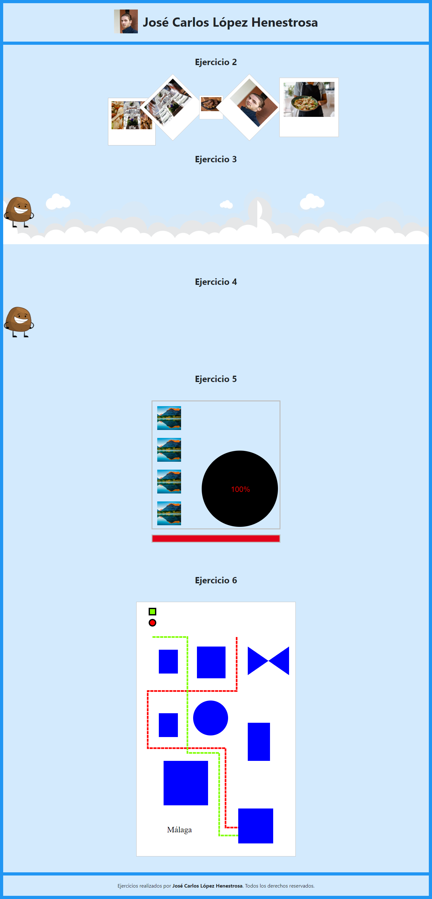
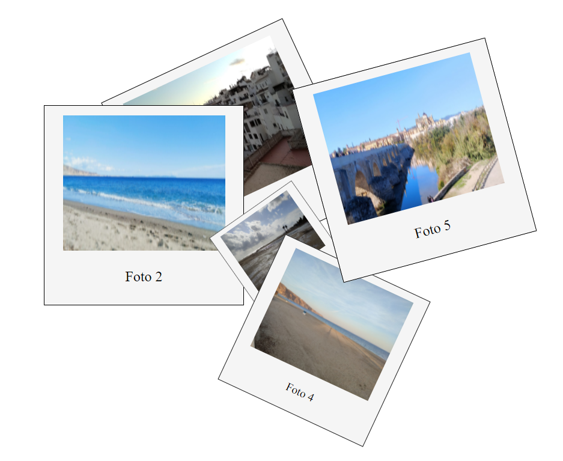
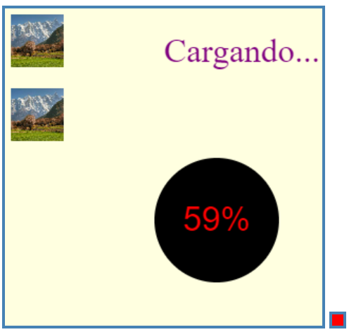
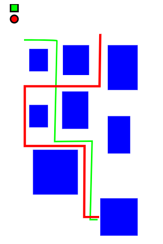

# TAREA Unidad 5: Contenidos multimedia en la Web: Animaciones

## Índice

- [¿Qué te pedimos que hagas?](#qué-te-pedimos-que-hagas)
	- [Ejercicio 1: Maqueta realizada con tecnología grid. (0,75 puntos)](#ejercicio-1-maqueta-realizada-con-tecnología-grid-075-puntos)
	- [Ejercicio 2: Composición de imágenes (1,5 puntos)](#ejercicio-2-composición-de-imágenes-15-puntos)
	- [Ejercicio 3: Animaciones HTML5 y CSS3 (`@keyframe`) (2 puntos)](#ejercicio-3-animaciones-html5-y-css3-keyframe-2-puntos)
	- [Ejercicio 4: Guía de estilo. (0,75 puntos)](#ejercicio-4-guía-de-estilo-075-puntos)
	- [Ejercicio 5: Animaciones con canvas. (2,5 puntos)](#ejercicio-5-animaciones-con-canvas-25-puntos)
	- [Ejercicio 6: Animaciones con SVG. (2,5 puntos)](#ejercicio-6-animaciones-con-svg-25-puntos)
- [Resultado](#resultado)

## ¿Qué te pedimos que hagas?

### Ejercicio 1: Maqueta realizada con tecnología grid. (0,75 puntos)

Crea una página web cuya estructura principal (maqueta) esté implementada con **grid**. En dicha página mostraremos lo que se pide en los siguientes ejercicios.

La página debe contener un encabezado, una zona de contenido y un pie de página. En el encabezado adjunta tu nombre y apellidos y una foto tuya. En la zona de contenido estarán todos los ejercicios que se piden y el pie puedes configurarlo como quieras.

### Ejercicio 2: Composición de imágenes (1,5 puntos)

Para mostrar imágenes de nuestros platos, vamos a realizar una composición con 4 o 5 fotos estilo Polaroid (como se muestra en la imagen).

1. Las fotos deben aparecer en pantalla con diferentes transformaciones, giros, escalados, desplazamientos y éstas deben estar superpuestas unas encima de otras (no tienen que estar totalmente superpuestas).
2. Al hacer click en una foto, se debe realizar una transición de tal forma que la foto haga un movimiento lateral, por ejemplo, de izquierda a derecha y se sitúe en el centro de la pantalla (aproximadamente). En esta transición se tiene que realizar un escalado para que la foto aparezca recta en pantalla. También se debe aplicar un filtro (brillo, negativo, etc).

	

		
	

### Ejercicio 3: Animaciones HTML5 y CSS3 (`@keyframe`) (2 puntos)

Vamos a realizar la animación que se incorporará a la cabecera de nuestro futuro desarrollo web:
- Debe aparecer un logo desplazándose de un extremo a otro, por ejemplo, de izquierda a derecha (o viceversa). El logo debe aparecer con un tamaño inferior al real y, conforme se desplaza, debe ir aumentando hasta llegar al centro (en este punto el logo debe tener un tamaño mayor que el real). En el resto del desplazamiento, el logo debe reducir su tamaño hasta quedarse con el tamaño real.
- Cuando el logo esté en la mitad de la cabecera, el nombre de nuestra empresa u organización debe aparecer de arriba abajo (o viceversa) y debe posicionarse en mitad de la cabecera (tanto horizontalmente como verticalmente). Debe haber un cambio de color del nombre de la empresa.
- El logo y el nombre de la empresa deben finalizar (posicionarse) los dos al mismo tiempo. Así, el nombre debe quedar centrado horizontal y verticalmente en la cabecera y el logo debe quedar en un extremo.
- Incorpora otro elemento en la cabecera y anímalo como quieras.Dale rienda suelta a tu imaginación.
- El código de la animación debe estar perfectamente documentado.
- La animación tiene que ser estética (se valorará el diseño) y los elementos deben mostrarse de forma coherente.

### Ejercicio 4: Guía de estilo. (0,75 puntos)

Hemos visto cómo aplicar animaciones y transiciones con CSS a diferentes elementos de un desarrollo. Crea una pequeña animación (o transición) que podamos incorporar a nuestro desarrollo e indica cómo habría que utilizarla para que quede constancia en nuestra guía de estilo. Puedes aplicarla a un botón, opción de menú, un texto, en la forma de mostrar una imagen, etc. algo que quede estético y no quede sobrecargado.

### Ejercicio 5: Animaciones con canvas. (2,5 puntos)

Vamos a realizar una animación de carga con Canvas, de tal forma que conforme avanza se vayan mostrando 3 o 4 imágenes. La animación consistirá en:
		
- Un círculo que vaya creciendo de menos a más.</li>
- En el centro del circulo debe aparecer los números de 0 a 100%, conforme avanza la carga de las imágenes.
- Las imágenes deben aparecer conforme avanza la animación. Por ejemplo, la primera debe aparecer en el 25%, el segundo en el 50%, etc.
- La animación debe empezar al pulsar un "botón de inicio" que debe ser otro canvas diferente.

Toda la animación debe estar realizada con canvas.

A continuación, se muestra una imagen para dar una idea de lo pedido, pero no tienes que realizarlo igual.

	

### Ejercicio 6: Animaciones con SVG. (2,5 puntos)

Vamos a realizar una animación con SVG. Para ello, vamos a simular un pequeño callejero y cómo llegar de un punto A a un punto B con dos métodos diferentes, por ejemplo, andando y en coche. Para ello, tendrás que:

- Dibujar 6 o 7 figuras geométricas (como mínimo), cuadrados, rectángulos, etc, simulando edificios o elementos de una ciudad.
- Dibujarás dos elementos (por ejemplo, un cuadrado y un círculo) que simularán un coche y una persona.
- Tendrás que dibujar dos rutas diferentes (colores distintos) que vayan de un punto a otro, rodeando los edificios (simulados). Por ejemplo, un cuadrado puede simular un camino andando y un círculo el camino en coche.
- La animación andando empezará al hacer clic sobre el objeto que simula una persona y la animación en coche empezará cuando finalice la animación de la persona. El objeto que simule el coche se quedará al final de la animación.
- Las rutas deben tener colores diferentes y los tiempos de las animaciones deben ser diferentes.
- Debe aparecer un mensaje animado indicando el nombre de la localidad.

**Nota**: Como sabes, una imagen SVG no deja de ser un fichero en XML. Puedes utilizar un programa, como Inkscape, para simular los edificios y analizar dicho código para utilizarlo en tu desarrollo.

	

---

## Resultado

**Calificación**: 9,00 / 10,00

Calificado el lunes, 16 de junio de 2022, 13:13 por	Cejudo Morillo, Rafael Roberto

**Comentario mío**: No entiendo por qué no es un 10 ya que no hay justificación sobre los supuestos errores cometidos.