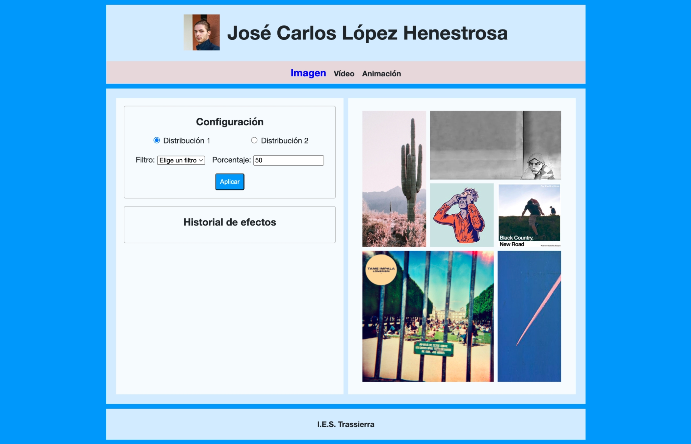
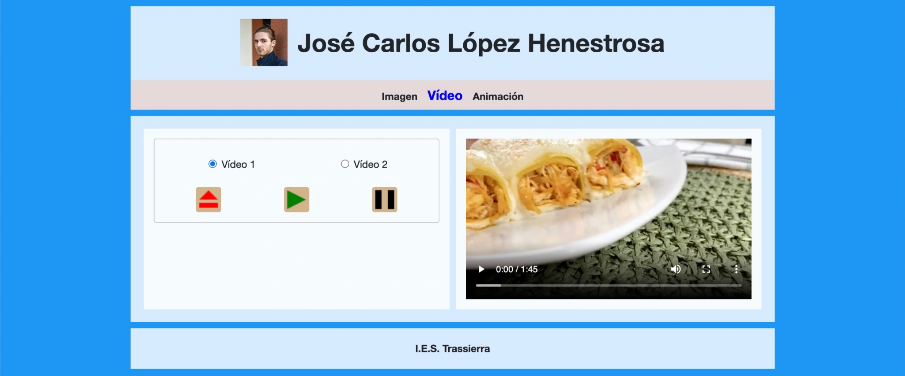
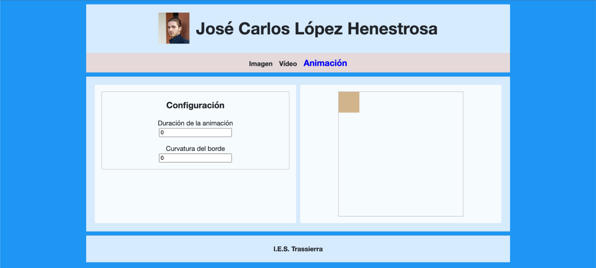
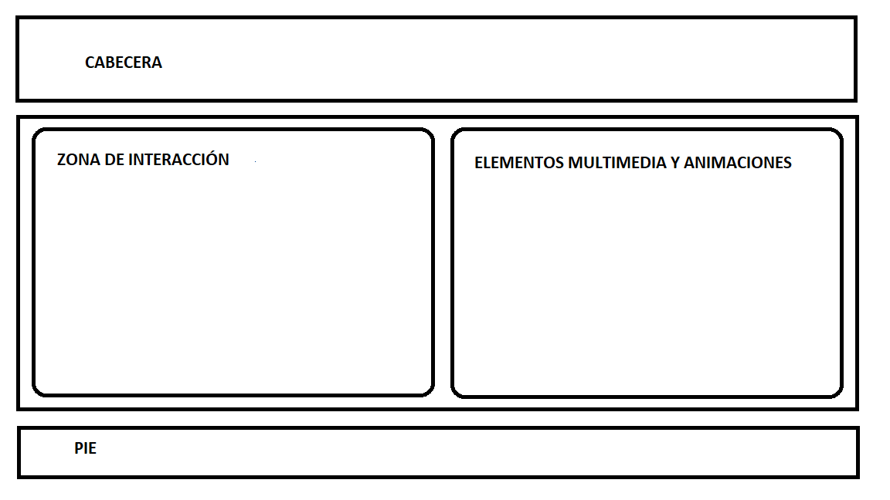
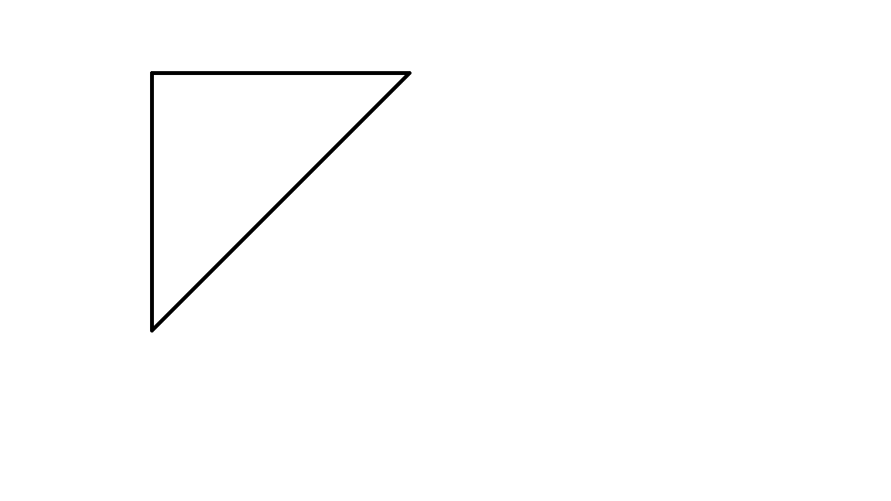

# TAREA Unidad 6: Contenidos web interactivos

## Índice

- [¿Qué te pedimos que hagas?](#qué-te-pedimos-que-hagas)
	- [General](#general)
	- [Imagen](#imagen)
	- [Vídeo](#vídeo)
	- [Animación](#animación)
- [Resultado](#resultado)

 

## ¿Qué te pedimos que hagas?

### General

La página estará divida en tres zonas: cabecera, zona de contenido (dividida en dos partes) y pie. La estructura debe ser similar a la siguiente:

Cada uno de estos elementos contendrá la siguiente información:

- **CABECERA**
	- En la parte superior, debes incluir tu nombre y una fotografía tuya (puedes coger la que has puesto en tu perfil de la plataforma de enseñanza a distancia).
	- Debajo del nombre y la foto debes incluir tres opciones (incluidas en una única fila):
		- Imagen
		- Vídeo
		- Animación
	- Funcionalidad del menú al pulsar una de las tres opciones:
		- Al cargarse la página:
			- Ninguna de las opciones deben estar seleccionadas y el estilo de las mismas tiene que ser el mismo.
			- No debe aparecer ningún bloque en ninguna de las Zonas de interacción y en la zona de Elementos multimedia y animaciones, solo el nombre de las dos zonas y la descripción de para que sirve cada zona.
		- Cuando pulses o selecciones una de las opciones:
			- La opción seleccionada debe ponerse en otro color y aumentar su fuente, el resto deben estar en el color base  y una fuente de menor tamaño.
			- Debe aparecer en la **Zona de contenido** los bloques correspondientes a la opción, tanto en la **Zona de interacción** como en la zona **Elementos multimedia y animaciones**. 
			- Los paneles que hay en cada una de las **Zonas de contenido**, deben mostrarse y ocultarse con un efecto `fadein` y `fadeout` (el tiempo debe durar lo suficiente para que se aprecie el cambio del efecto).
			- Dependiendo de la opción pulsada los elementos de la Zona de interacción y Zona de objetos irán cambiando. Así por ejemplo en la parte de imagen en la Zona de interacción se mostrarán un conjunto de opciones que podremos manipular y en la zona elementos multimedia y animaciones aparecerá un collage de imágenes.
- **ZONA DE CONTENIDO**
	- **Zona de interacción**
		- Ocupará la mitad izquierda de la zona de contenidos.
		- En esta parte se deben incluir 3 bloques, uno por cada una de las opciones indicadas en la cabecera (imagen, vídeo y animación) aunque solo será visible el correspondiente a la opción seleccionada en la cabecera. El resto deben ocultarse.
		- Se elegirán un conjunto de efectos y opciones que se aplicarán a los elementos multimedia o animaciones que hay en la zona de la derecha (elementos multimedia y animaciones).
		- La descripción de los 3 bloques está incluida en sus apartados correspondientes.
	- **Elementos multimedia y animaciones**
		- Ocupará la mitad derecha de la zona de contenidos.
		- En esta parte se deben incluir 3 bloques, uno por cada una de las opciones indicadas en la cabecera (imagen, vídeo y animación) aunque solo será visible el correspondiente a la opción seleccionada en la cabecera.
		- Se mostrarán elementos multimedia o animaciones que se verán modificados en función de las opciones elegidas en la zona de la izquierda (zona de interacción).
		- La descripción de los 3 bloques está incluida en sus apartados correspondientes.
	- **Pie**: En el pie de página aparecerá el nombre del instituto centrado. El texto del pie de página tendrá un color de fondo, y el texto otro color que resalte. Cuando se sitúe el ratón sobre el texto, se producirá una transición, que durará el tiempo que estimes oportuno, tal que el color de fondo pasará a tener el color que tenía el texto, y el texto el color que tenía el fondo. Esto no es necesario realizarlo con *jQuery*.

### Imagen

Para realizar este apartado debes seleccionar un total de 6 fotografías de diferentes platos de comida. Se suministran unas imágenes de ejemplo que debes cambiar por otras tuyas.

Al elegir la opción imagen, se deben mostrar en la zona de contenido los bloques correspondientes a esta opción. Los bloques de contenido incluirán:

- **ZONA DE INTERACCIÓN**
	- **Selección de distribución**: Se debe poder elegir entre dos posibles distribuciones o collage (recuerda que deben implementarse con un grid) y según se elija una u otra, las fotos de los platos aparecerán distribuidas de forma diferente en la zona de la derecha (elementos multimedia y animaciones). Al cambiar el collage, éste debe aparecer y desaparecer con un efecto slideUp y slideDown. Este efecto tiene que ser apreciable. Cuando se cambia de collage las modificaciones de efectos aplicadas deben desaparecer, quedando las imágenes como estaban inicialmente.
	- **Efectos**
		- Deben poder elegirse una o varias. Al elegirse una imagen, esta debe mostrarse con un borde rojo en el collage de la derecha.
		- Una vez seleccionadas las imágenes, se debe poder elegir un efecto, sobre 3 posibilidades (gris, invertido y sepia), que se le aplicará a la imagen o imágenes seleccionadas. Deberemos indicar también el valor o porcentaje que se le quiere aplicar a cada uno de los filtros elegidos. Si quieres añadir más filtros puedes realizarlo si quieres.
		- Por último se debe incluir un botón “Aplicar” que al pulsarlo se aplique el efecto elegido a las imágenes seleccionadas del collage y se desmarcan éstas y los campos de selección de imágenes que hemos seleccionado previamente.
	- **Historial de efectos**
		- Justo debajo de los efectos se debe ir generando un historial conforme se vayan aplicando efectos a las imágenes.
		- Por cada efecto que aplique, se debe indicar las imágenes que se han seleccionado y el efecto aplicado.
	- **Recuerda**
		- Cada vez que elegimos una distribución de imágenes distinta, las imágenes deben aparecer sin ningún filtro aplicado y el historial de cambios debe desaparecer.
		- Debes cambiar el collage que viene como ejemplo en los ficheros base, así como las imágenes suministradas.
		- El collage debe estar implementado con una estructura de grid.
- **ELEMENTOS MULTIMEDIA Y ANIMACIONES**
	- En este bloque debe aparecer un collage formado por las imágenes de los 6 platos con una distribución u otra en función de la distribución seleccionada. La estructura del collage debe implementarse con un grid.
	- Inicialmente deben cargarse las imágenes con la distribución 1 y al pulsar en la distribución 2 deben reorganizarse con una nueva distribución.  
	- Las imágenes que se seleccionen para aplicarle un efecto deben aparecer marcadas con un marco rojo.
	- Las imágenes se irán modificando conforme a los efectos seleccionados y aplicados en la zona de la izquierda.

### Vídeo

Para realizar este apartado debes seleccionar un total de 2 vídeos de diferentes recetas de cocina. Estos tienen que tener una duración aproximada de un minuto y estar en un formato adecuado para incluirlo en la web.

Al elegir la opción vídeo, se deben mostrar en la zona de contenido los bloques correspondientes a esta opción. Inicialmente no debe aparecer ningún video cargado. Los bloques de contenido incluirán:

- **ZONA DE INTERACCIÓN**
	- **Selección de vídeo**: Se debe poder elegir entre dos vídeos y según se elija uno u otro, este será el que se cargue posteriormente en la zona de la derecha (elementos multimedia y animaciones).
	- **Interacción**. Deben incluirse estos tres botones dibujados utilizando canvas:
		- **Cargar**: Al pulsar este botón se debe mostrar el vídeo seleccionado anteriormente en la zona de la derecha (elementos multimedia y animaciones). En el caso de que previamente estuviera cargado el otro vídeo, este debe ocultarse.
		- **Reproducir**: Al pulsar este botón debe comenzar a reproducirse el vídeo.
		- **Pausa**: Al pulsar este botón debe pararse la reproducción del vídeo.
- **ELEMENTOS MULTIMEDIA Y ANIMACIONES**
	- En este bloque aparecerá el vídeo que se seleccione y cargue en la zona de la izquierda (zona de interacción).
	- Inicialmente no debe aparecer ningún vídeo.  
	- Una vez que se cargue un vídeo, este será irá reproduciendo o pausando en función de las botones que se pulsen.

### Animación

Dentro de esta opción lo que vamos a realizar es manipular una animación realizada con CSS con dos parámetros como son el tiempo que dura la animación y la forma del objeto que se está moviendo. En nuestro caso hemos puesto un objeto cuadrado que realiza un movimiento triangular. Nosotros podremos modificar el tiempo que dura la animación y el borde redondeado, de tal forma que pueda pasar de un cuadrado a un círculo. En cada esquina de la animación el objeto cambia de color. Para que la animación esté siempre en movimiento tiene que tener infinitas iteraciones, recuerda configurar este parámetro en la animación, sino, solo se realizará una animación con las iteraciones indicadas y se parará. 

Al elegir la opción animación, se deben mostrar en la zona de contenido los bloques correspondientes a esta opción. Los bloques de contenido incluirán:

- **ZONA DE INTERACCIÓN**
	- **Duración de la animación**: Se debe poder elegir la duración de la animación, que será entre 0 y 15 segundos. Inicialmente estará seleccionado el valor 0, por lo que no se estará ejecutando la animación.
	- **Borde redondeado**: Se debe indicar un valor entre 0 y 90 píxeles para el redondeo de los bordes del cuadrado de la animación. Inicialmente el valor es 0 y al cambiarlo se debe ver reflejado el cambio en el cuadrado que realiza la animación.
	- Los cambios se deben reflejar de forma inmediata en la animación, es decir, al cambiar el tiempo o el valor del borde este debe reflejarse en el objeto animado.
- **ELEMENTOS MULTIMEDIA Y ANIMACIONES**
	- En este bloque aparecerá una animación, realizada con canvas. 
	- La animación consistirá en un cuadrado, que inicialmente se encontrará en la esquina superior izquierda del lienzo, y debe desplazarse por el lienzo siguiendo las direcciones siguientes:  derecha, abajo-izquierda y arriba. Al llegar al inicio volvería a empezar de nuevo. Las repeticiones del bucle deben ser infinitas. Os dejo un gráfico con la trayectoria que tiene que llevar el cuadrado.
	 
	

		
	

---

## Resultado

**Calificación**: 8,85 / 10,00

Calificado el lunes, 16 de junio de 2022, 13:17 por	Cejudo Morillo, Rafael Roberto

**Comentario mío**: No entiendo por qué no es un 10 ya que no hay justificación sobre los supuestos errores cometidos.